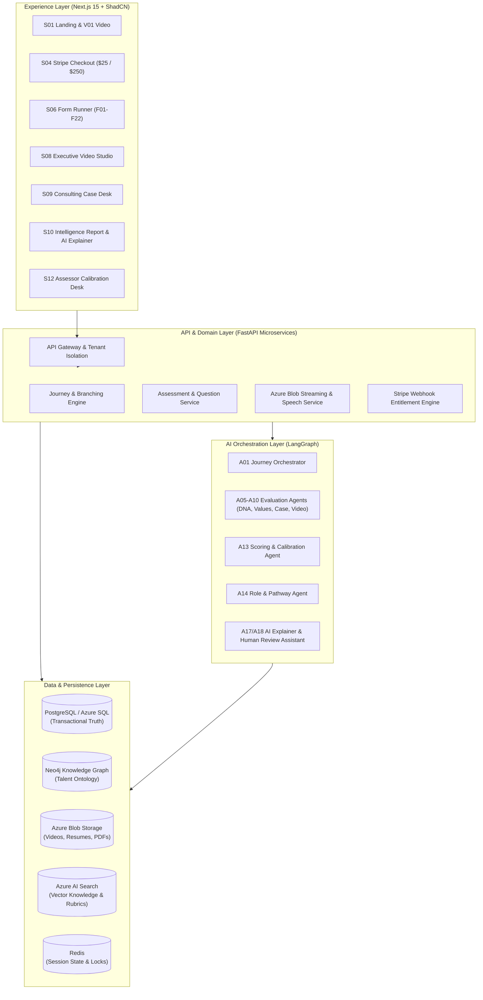

# METI: Modus Enterprise Talent Intelligence Platform
## Enterprise Management Consulting Track — Technical Design & Architecture Documentation (TDD v1.1)

Welcome to the **METI Enterprise Platform** engineering repository. This project implements the end-to-end management consulting assessment, capability benchmarking, multi-agent AI orchestration, and talent development platform specified in **TDD v1.1**.

---

## 📚 Master Architectural Documentation Index

| Document | Primary Focus | Key Contents |
| :--- | :--- | :--- |
| **[Business Requirements & Strategic Context](file:///d:/MODUS%20HACKTOHON/docs/BUSINESS_REQUIREMENTS.md)** | Strategic Context & Business Model | • Industry Problem Statement & Business Opportunity • Commercial Two-Tier Entitlement Model ($25 vs $250) • Detailed Stakeholder Requirements • 5 Core Desired Output Artifacts • Comprehensive KPIs (Commercial, Psychometric, Fairness, Engineering) |
| **[System Architecture & Master Design](file:///d:/MODUS%20HACKTOHON/docs/ARCHITECTURE.md)** | Engineering & System Topology | • End-to-End Logical System Topology & Ingress Layer • 20-Agent LangGraph State Machine Workflow • Polyglot Data Model (PostgreSQL + Neo4j Graph + Azure Blob) • Speech-to-Text & Video Communication Pipeline • Security, Privacy, Anti-Injection & DevSecOps CI/CD |
| **[Frontend Architecture & Design System](file:///d:/MODUS%20HACKTOHON/docs/FRONTEND_ARCHITECTURE.md)** | Client Layer & User Experience | • Next.js 15 App Router Screen Map (S01–S16) • Question Factory Engine (QT01–QT15) & Form Registry (F01–F22) • Sub-2s Autosave & IndexedDB Offline Sync Queue • WebRTC Video Studio & Case Workspace Layout • Recharts Radar & D3 Schwartz Circumplex Visualizations • WCAG 2.2 AA Accessibility Specifications |
| **[Data Models & Multi-Agent Catalog](file:///d:/MODUS%20HACKTOHON/docs/DATA_MODEL_AND_AGENTS.md)** | Schemas & Agent Specifications | • PostgreSQL DDL Schema (Candidates, Attempts, Scores, Entitlements) • Neo4j Talent Knowledge Graph Ontology & Cypher Query Patterns • Complete Catalog of 20 AI Agents (A01–A20) with I/O Contracts • Python Scoring & Ipsative Centering Algorithms |

---

## 🏛️ Executive Architecture Diagram

---

## 🚀 Quick Reference: Key Technical & Business Attributes

* **Target Stack:** Next.js 15, React 19, TypeScript, Tailwind CSS, ShadCN UI, FastAPI, PostgreSQL, Neo4j, Redis, Azure OpenAI, LangGraph, Azure Blob Storage.
* **Commercial Tiers:**
  * **$25 Entry:** Management Consulting Assessment (`MC-A`) or Professional Personality & Values (`PV-A`) $\to$ includes immediate **Summary of Findings**.
  * **$250 Premium Upgrade:** Product `D250` $\to$ unlocks full **25–40 page Report**, **16-Week Personalized Roadmap**, and **Interactive AI Results Explainer**.
* **Integrity & Fairness:** Capped self-report ($0.25$), heavy demonstrated evidence weighting ($0.85$ case, $0.80$ video), zero facial/accent/emotion evaluation, strict separation of demographic attributes from scoring vectors.
