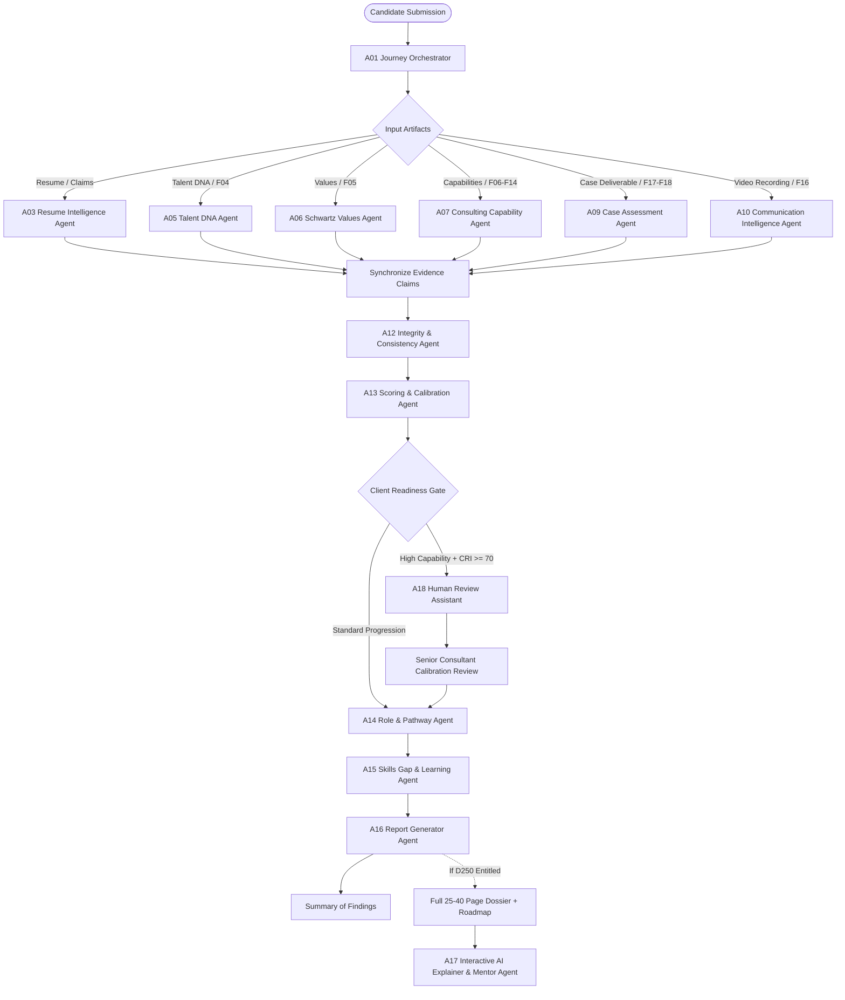
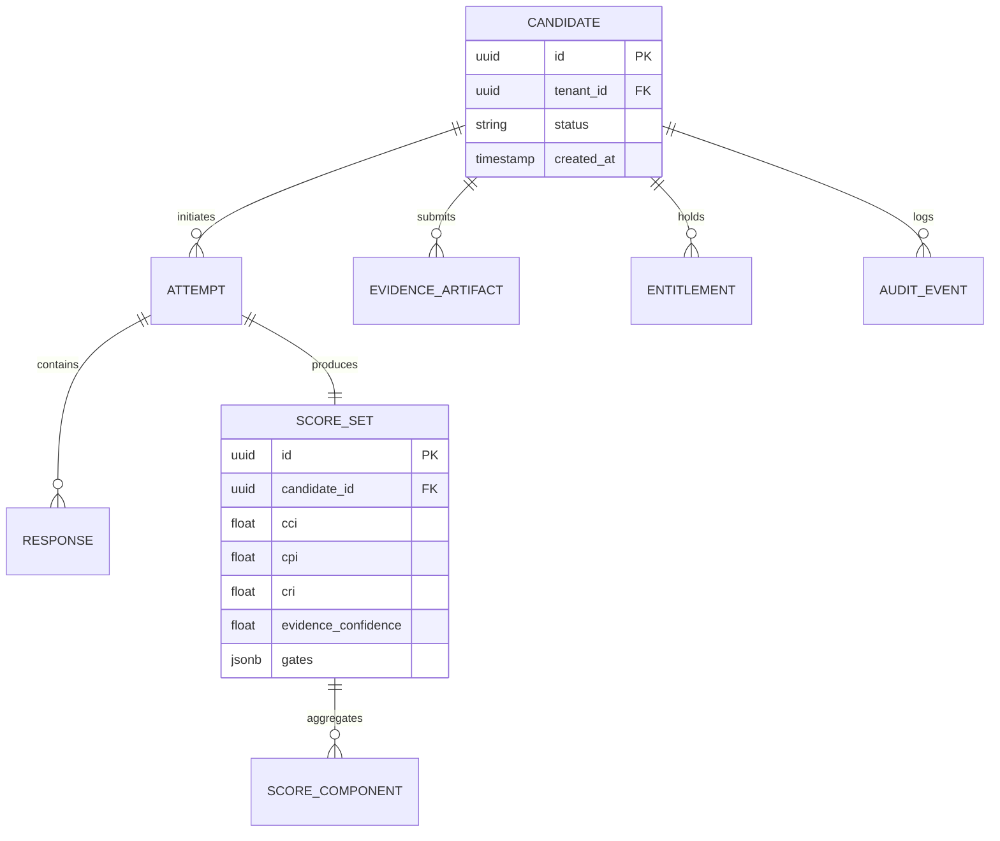
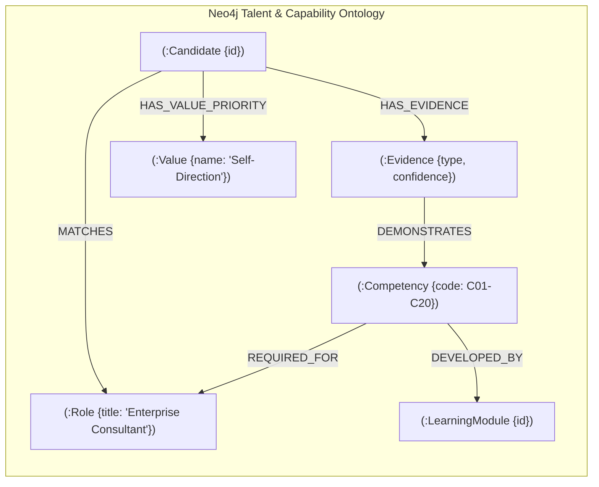
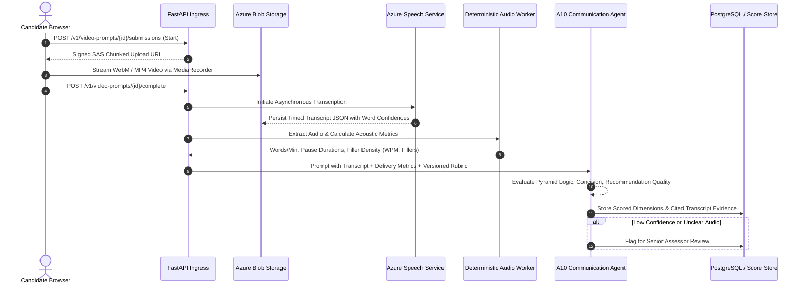
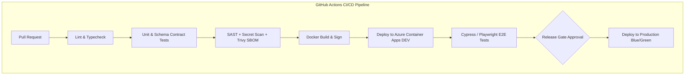

# METI Platform: Technical Architecture & System Design
## Master Architectural Blueprint (TDD v1.1 Alignment)

---

## 1. System Topology & Logical Architecture

METI is designed as a modular, distributed, cloud-native enterprise platform. It decouples high-performance client interactions (Next.js 15), resilient transactional business services (FastAPI), graph-based talent intelligence (Neo4j), and multi-agent AI orchestration (LangGraph + Azure OpenAI).

```mermaid
graph TD
    subgraph ClientTier["Client Experience Layer (Next.js 15 App Router)"]
        UI_Cand["Candidate Portal (S01-S10)"]
        UI_Assess["Assessor Calibration Desk (S12)"]
        UI_Mentor["Mentor Workspace (S11)"]
        UI_Admin["Admin & Psychometrics Suite (S13-S16)"]
    end

    subgraph GatewayTier["API Gateway & Ingress Layer"]
        Traefik["Reverse Proxy / Cloud Ingress"]
        AuthMiddleware["JWT / OIDC / Entra ID Guard"]
        TenantMiddleware["Multi-Tenant Isolation Scoper"]
        RateLimiter["Redis Token Bucket Rate Limiter"]
    end

    subgraph ServiceTier["Application & API Services (FastAPI)"]
        Svc_Auth["Auth & Consent Service"]
        Svc_Journey["Journey & Branching Engine"]
        Svc_Assess["Assessment & Question Service"]
        Svc_Media["Media Streaming & SAS Upload Service"]
        Svc_Commerce["Stripe Commerce & Entitlements"]
        Svc_Report["Report Generation & PDF Service"]
    end

    subgraph OrchestrationTier["AI Multi-Agent Pipeline (LangGraph)"]
        A_Orch["A01 Journey Orchestrator"]
        A_Resume["A03 Resume Intelligence Agent"]
        A_Values["A05/A06 Talent DNA & Schwartz Agents"]
        A_Capability["A07 Consulting Capability Agent"]
        A_Case["A09 Case Assessment Agent"]
        A_Comm["A10 Communication Intelligence Agent"]
        A_Score["A13 Scoring & Calibration Agent"]
        A_Explainer["A17/A18 AI Results Explainer & Review Assistant"]
    end

    subgraph DataTier["Polyglot Data & Storage Layer"]
        PG[("PostgreSQL / Azure SQL<br/>(Transactional Source of Truth)")]
        Neo[("Neo4j Graph Database<br/>(Competency & Evidence Graph)")]
        Blob[("Azure Blob Storage<br/>(Videos, Resumes, Artifacts, PDFs)")]
        Search[("Azure AI Search<br/>(Vector Knowledge & Rubric Grounding)")]
        Redis[("Redis<br/>(Session Cache, Queues, LangGraph Locks)")]
    end

    ClientTier --> GatewayTier
    GatewayTier --> ServiceTier
    ServiceTier --> OrchestrationTier
    ServiceTier --> DataTier
    OrchestrationTier --> DataTier
```

---

## 2. Multi-Agent AI Orchestration Architecture (LangGraph)

The platform deploys **20 specialized, single-responsibility AI agents (A01–A20)** structured as a deterministic directed acyclic state graph (DAG) via **LangGraph**:

### 2.1 Agent Contracts & Guardrails
* **Stateless Execution:** Agents carry no volatile in-memory state; shared state is checkpointed in PostgreSQL and Redis.
* **Strict Pydantic JSON Schemas:** Every agent input and output must conform to strict JSON schemas. Unparsable outputs trigger a single automated self-correction prompt before gracefully falling back to human review.
* **Grounding Constraint:** Report and explanation agents (`A16`, `A17`) are explicitly restricted to locked score and evidence JSON snapshots stored in PostgreSQL; web crawling or hallucinated trait inferences are structurally blocked.

---

## 3. Polyglot Persistence & Evidence Graph Model

METI solves the impedance mismatch between relational business transactions and multi-dimensional talent graphs through a **Dual-Persistence Pattern**:

### 3.1 Data Segregation Strategy
1. **PostgreSQL / Azure SQL:** Manages transactional state, billing records, immutable versions of questions, responses, composite scores, and audit events.
2. **Neo4j Enterprise Graph:** Stores the dynamic capability network, mapping evidence nodes to competency vertices, proficiency tiers (L0–L4), and target role vectors.
3. **Azure Blob Storage:** Secure object store for raw candidate video/audio streams, parsed resumes, case exhibits, and generated PDF reports with time-limited SAS tokens.
4. **Azure AI Search:** Vector embeddings of verified frameworks, case guidance rubrics, and scoring benchmarks for retrieval-augmented agent grading.

---

## 4. End-to-End Video & Speech Evaluation Pipeline

---

## 5. Security, Privacy & Fairness Architecture

1. **Complete Decoupling of Demographic Data:** Candidate demographic fields (gender, age, ethnicity, city, personal commitments) are isolated in a restricted table and excluded from AI agent prompts and scoring pipelines.
2. **Zero Inferences on Video Appearance:** The video assessment engine evaluates *only* transcribed content, verbal structuring, and delivery pacing (WPM, pauses). Facial recognition, emotion detection, eye tracking, attractiveness, and accent scoring are explicitly blocked by code contracts.
3. **Anti-Prompt-Injection Safeguards:** All uploaded documents (resumes, case attachments, free-text inputs) are treated as untrusted data strings. Input sanitizers strip command delimiters, and extraction agents use strict tool-call boundaries.
4. **Multi-Tenant Data Isolation:** Tenant boundaries (`tenant_id`) are enforced at the database row level (PostgreSQL Row-Level Security), graph query level, and object storage container level.

---

## 6. DevSecOps & Deployment Topology

* **Target Infrastructure:** Azure Container Apps (serverless, auto-scaling containers for Next.js frontend and FastAPI microservices).
* **Managed Services:** Azure Database for PostgreSQL, Neo4j Aura Enterprise, Azure Blob Storage, Azure Key Vault, Azure Monitor & Application Insights.
