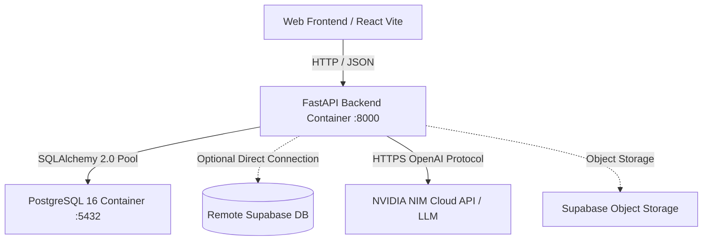

# METI Backend Engineering & Docker Architecture Plan

## Executive Summary
This document outlines the end-to-end software engineering plan to construct the backend for **METI (Modus Enterprise Talent Intelligence Platform)**.
The implementation follows the authoritative requirements in **METI TDD v1.1** and the **Master Backend Software Requirements & Architecture Specification**.

The backend operates as the **authoritative application layer** for state management, server-side timers, evidence provenance, multi-index scoring (CCI, CPI, CRI), NVIDIA NIM-powered case evaluation, and human assessor calibration.

---

## 1. System & Container Architecture

### 1.1 Container Topologies (`docker-compose.yml`)

The platform will run cleanly in a multi-container Docker environment with dual-database flexibility (local PostgreSQL container by default, or direct Supabase connection via environment configuration):



### 1.2 Service Specifications
1. **`backend` service**:
   - **Base Image:** `python:3.11-slim`
   - **Exposed Port:** `8000` (mapped to `localhost:8000`)
   - **Application Server:** `uvicorn app.main:app --host 0.0.0.0 --port 8000 --reload`
   - **Healthcheck:** `curl -f http://localhost:8000/health || exit 1`
2. **`db` service**:
   - **Base Image:** `postgres:16-alpine`
   - **Exposed Port:** `5432` (internal Docker network & local host)
   - **Persistence:** Named volume `meti_postgres_data`
   - **Healthcheck:** `pg_isready -U postgres -d meti_db`

---

## 2. Directory Structure

```text
backend/
├── Dockerfile
├── requirements.txt
├── .env.example
├── app/
│   ├── __init__.py
│   ├── main.py                          # FastAPI app instance, CORS, router mounting, lifespan
│   ├── core/
│   │   ├── __init__.py
│   │   ├── config.py                    # Pydantic Settings (DB URLs, NVIDIA Key, Supabase)
│   │   ├── security.py                  # Auth context & RBAC helpers
│   │   └── errors.py                    # Domain exception handlers
│   ├── db/
│   │   ├── __init__.py
│   │   ├── session.py                   # SQLAlchemy engine, session maker, get_db dependency
│   │   ├── base.py                      # DeclarativeBase, Common Mixins (Timestamp, Tenant)
│   │   └── seed.py                      # Deterministic MVP seed data loader
│   ├── models/
│   │   ├── __init__.py
│   │   ├── candidate.py                 # Candidate, Profile, Consent
│   │   ├── assessment.py                # Assessment, Section, Question, Rubric
│   │   ├── attempt.py                   # Attempt, Response
│   │   ├── case.py                      # CaseStudy, CaseAttempt, Deliverable
│   │   ├── score.py                     # ScoreRecord, ScoreComponent, Report
│   │   └── audit.py                     # AuditEvent, AssessorReview
│   ├── schemas/
│   │   ├── __init__.py
│   │   ├── candidate.py
│   │   ├── assessment.py
│   │   ├── attempt.py
│   │   ├── case.py
│   │   ├── score.py
│   │   └── assessor.py
│   ├── services/
│   │   ├── __init__.py
│   │   ├── assessment_engine.py         # Attempt lifecycle, branching, server timers
│   │   ├── scoring_engine.py            # CCI, CPI, CRI formulas & evidence confidence
│   │   ├── llm_evaluator.py             # NVIDIA NIM integration (Llama-3.1-70b) + Rule fallback
│   │   ├── case_service.py              # OmniRetail consulting deliverable manager
│   │   └── assessor_service.py          # Human calibration, override rationale, audit logging
│   └── api/
│       └── v1/
│           ├── __init__.py
│           ├── health.py
│           ├── candidates.py
│           ├── assessments.py
│           ├── attempts.py
│           ├── cases.py
│           ├── scores.py
│           └── assessor.py
docker-compose.yml
```

---

## 3. Core Database Models & Domain Entities

### 3.1 Candidate & Governance
- **`candidates`**: `id`, `tenant_id`, `email`, `display_name`, `status`, `target_role`, `created_at`
- **`candidate_profiles`**: `candidate_id`, `education`, `experience_years`, `current_role`, `target_level`
- **`consents`**: `candidate_id`, `consent_type`, `version`, `granted_at`, `status`

### 3.2 Versioned Assessment Definition
- **`assessments`**: `id`, `code` (`MC-A`), `version` (1.0), `status` (`PUBLISHED`), `time_limit_seconds` (3600)
- **`sections`**: `id`, `assessment_id`, `order_index`, `title`, `description`
- **`questions`**: `id`, `section_id`, `code`, `type` (`QT01`–`QT15`), `prompt`, `options` (JSONB), `scoring_rule` (JSONB), `competency_codes` (ARRAY)

### 3.3 Runtime & State Progression
- **`attempts`**:
  - `id`, `candidate_id`, `assessment_id`, `version`, `status` (`NOT_STARTED`, `IN_PROGRESS`, `PAUSED`, `SUBMITTED`, `COMPLETED`)
  - Server timer: `started_at`, `expires_at`, `duration_seconds`, `paused_seconds`, `locked_at`
- **`responses`**:
  - `id`, `attempt_id`, `question_id`, `response_value` (JSONB), `saved_at`, `is_final`

### 3.4 Work-Sample Case (OmniRetail Transformation)
- **`case_studies`**: `id`, `title`, `industry`, `objective`, `constraints`, `brief`, `time_limit_minutes` (45)
- **`case_attempts`**: `id`, `candidate_id`, `case_id`, `status` (`IN_PROGRESS`, `SUBMITTED`, `SCORED`), `started_at`, `expires_at`
- **`case_deliverables`**: Structured fields for the 11 consulting outputs (Problem Statement, Issue Tree, Recommendations, 90-Day Roadmap, etc.)

### 3.5 Scoring, Calibration & Audit
- **`score_records`**:
  - `attempt_id`, `candidate_id`
  - `cci`: Consulting Capability Index (0–100)
  - `cpi`: Consulting Potential Index (0–100)
  - `cri`: Client Readiness Index (0–100)
  - `evidence_confidence`: Aggregated confidence metric (0–100)
  - `development_gap`: Gap metric to benchmark (0–100)
  - `role_match_score`: Fit percentage (0–100)
  - `is_client_ready`: Boolean gated by CRI thresholds & ethical checks
- **`score_components`**: Competency-level breakdown (C01–C20) with raw score, normalized score, confidence, and source evidence link.
- **`assessor_reviews`**: `attempt_id`, `reviewer_id`, `original_score`, `final_score`, `override_applied`, `reason` (mandatory for overrides), `reviewed_at`.
- **`audit_events`**: Immutable audit logs for score revisions, status changes, and publications.

---

## 4. Algorithmic Specifications & Scoring Mechanics

### 4.1 TDD Multi-Index Scoring Engine
$$\text{Competency Score} = \text{Normalized Evidence} \times \text{Evidence Confidence} \times \text{Mapping Weight}$$

- **Evidence Confidence (EC) Weights**:
  - **Self-Report Responses:** $0.25$
  - **Prior Verified Work:** $0.50$
  - **Structured Case Work Sample:** $0.85$
  - **Video Executive Communication:** $0.90$
  - **Human Assessor Review:** $1.00$

- **Consulting Capability Index (CCI):**
  Weighted average of demonstrated competency mastery across core domains:
  - C01–C04: Problem Solving & Structuring (MECE, Issue Trees, Hypothesis)
  - C05–C08: Strategy & Operating Models (Target Operating Model, Value Chain)
  - C09–C12: Quantitative & Financial Rigor (EBITDA bridge, margin analysis)
  - C13–C16: Transformation & Change Leadership
  - C17–C20: Executive Presence & Synthesis

- **Client Readiness Index (CRI):**
  $$CRI = \text{Weighted Capability} \times \text{Mandatory Gate Multiplier}$$
  - **Gate 1:** No severe ethics or integrity violation.
  - **Gate 2:** Executive communication threshold $> 60$.
  - **Gate 3:** Mandatory human assessor calibration sign-off.

---

## 5. NVIDIA NIM LLM Integration & Hybrid Fallback

### 5.1 LLM Service Design (`services/llm_evaluator.py`)
- Utilizes the OpenAI-compatible standard client pointing to:
  - **Base URL:** `https://integrate.api.nvidia.com/v1`
  - **Model:** `meta/llama-3.1-70b-instruct` (or `mistralai/mixtral-8x7b-instruct`)
  - **API Key:** `NVIDIA_API_KEY`
- **Evaluation Tasks:**
  1. **Issue Tree Rigor:** Evaluates MECE compliance, depth of breakdown, and hypothesis clarity.
  2. **Strategic Synthesis:** Evaluates executive brevity, data-backed reasoning, and structured 90-day sequencing.
- **Resilience / Fallback Guarantee:**
  If the API key is not yet set or external connectivity fails, the engine gracefully activates the **Deterministic Rule-Based Evaluator**, guaranteeing that the application never breaks or hangs.

---

## 6. API Route Catalog (`/api/v1`)

| Method | Endpoint | Description |
|---|---|---|
| `GET` | `/health` | Container and database health status |
| `GET` | `/api/v1/candidates/me` | Fetch active candidate profile |
| `GET` | `/api/v1/candidates/me/dashboard` | Aggregated dashboard state |
| `GET` | `/api/v1/assessments/active` | Get active published assessment definition |
| `POST` | `/api/v1/assessments/{id}/attempts` | Initialize a new attempt (starts server timer) |
| `GET` | `/api/v1/attempts/{id}` | Get attempt state, saved answers & remaining time |
| `PUT` | `/api/v1/attempts/{id}/responses/{qid}` | Idempotent autosave response endpoint |
| `POST` | `/api/v1/attempts/{id}/submit` | Lock attempt, trigger scoring engine |
| `GET` | `/api/v1/cases/{id}` | Retrieve case study brief & exhibits |
| `POST` | `/api/v1/cases/{id}/attempts` | Start timed case attempt (45 mins) |
| `PUT` | `/api/v1/case-attempts/{id}` | Autosave case deliverables |
| `POST` | `/api/v1/case-attempts/{id}/submit` | Submit case, trigger LLM rubric evaluation |
| `GET` | `/api/v1/candidates/me/scores` | Authoritative CCI, CPI, CRI & competency breakdown |
| `GET` | `/api/v1/candidates/me/roadmap` | 3-Phase personalized development roadmap |
| `GET` | `/api/v1/assessor/reviews` | Review queue of candidate attempts |
| `POST` | `/api/v1/assessor/reviews/{id}/override` | Calibrated score override with mandatory rationale |

---

## 7. Step-by-Step Implementation Roadmap

1. **Phase 1: Docker & Scaffold Infrastructure**
   - Create `backend/Dockerfile`, `docker-compose.yml`, and `backend/requirements.txt`.
   - Setup `app/core/config.py` with Pydantic settings reading `DATABASE_URL`, `NVIDIA_API_KEY`, and `SUPABASE_*` credentials.
2. **Phase 2: Database Layer & Models**
   - Implement `app/db/session.py`, `app/db/base.py`.
   - Implement SQLAlchemy models (`Candidate`, `Assessment`, `Attempt`, `Case`, `Score`, `Audit`).
3. **Phase 3: Domain Services & Algorithms**
   - Implement `ScoringService` (CCI, CPI, CRI, confidence formulas).
   - Implement `AssessmentEngine` (timer enforcement, attempt locking, branching).
   - Implement `LLMEvaluator` (NVIDIA NIM client with graceful rule fallback).
4. **Phase 4: API Endpoints & Schemas**
   - Implement Pydantic v2 schemas.
   - Implement API routers under `app/api/v1/`.
5. **Phase 5: Deterministic Data Seeding**
   - Implement `app/db/seed.py` preloading `MC-A v1.0` questions, OmniRetail case study, and demo candidate.
6. **Phase 6: Verification & Docker Launch**
   - Launch containers using `docker compose up --build`.
   - Test endpoints, verify OpenAPI Swagger docs at `http://localhost:8000/docs`.
