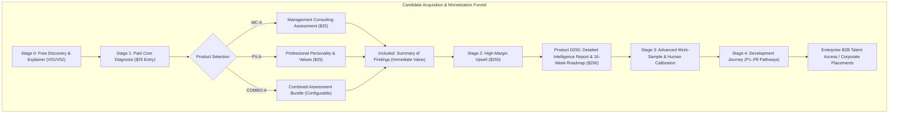

# METI: Modus Enterprise Talent Intelligence Platform
## Strategic Business Requirements, Problem Statement & Context Definition

---

## 1. Executive Context & Problem Statement

### 1.1 The Industry & Organizational Problem
Enterprise Management Consulting is undergoing a structural paradigm shift driven by digital transformation, generative AI, and complex value-chain reconfigurations. Traditional consulting recruitment and capability benchmarking models are fundamentally broken:
1. **Self-Report Bias & Resume Inflation:** Legacy application screening relies heavily on self-reported claims, static resumes, and prestigious institutional pedigree rather than verified, demonstrated analytical problem-solving and structured communication.
2. **Disconnected, Unversioned Form Tools:** The prior baseline used fragmented survey tools (e.g., Microsoft Forms) lacking autosave resilience, stateful branching, immutable versioning, secure evidence aggregation, and native psychometric rigor.
3. **High Screening Costs & Low Yield:** Senior partners and principals spend exorbitant billable hours reviewing unstructured submissions or conducting preliminary case screens on candidates who lack foundational problem-structuring discipline.
4. **Binary "Pass/Fail" Rejection with Zero Developmental Value:** Candidates rejected by traditional hiring funnels receive generic rejection emails, forfeiting opportunities for targeted bridge learning, mentoring, or future pipeline re-entry.
5. **Uncaptured Commercial Value:** Assessment operations represent an overhead cost center rather than a self-sustaining, high-margin commercial talent intelligence product.

### 1.2 The Modus Strategic Solution: METI
**METI (Modus Enterprise Talent Intelligence)** re-engineers management consulting evaluation into an **evidence-based, AI-orchestrated, dual-revenue talent intelligence and development platform**. 

METI transforms assessment from an operational cost into a profitable gateway that:
* Evaluates demonstrated consulting capability (issue structuring, executive presence, value chain synthesis) rather than mere self-assertion.
* Distinguishes capability from professional personality and personal motivational drivers (Schwartz Theory of Basic Human Values).
* Provides immediate diagnostic feedback while upselling a high-margin **USD 250 Detailed Intelligence Report & 16-Week Personalized Roadmap**.
* Channels candidates into structured, actionable development pathways (**P1–P8**), creating a continuous pipeline of enterprise-ready consulting talent.

---

## 2. Business Context & Strategic Commercial Model

### 2.1 The Two-Tier Commercial Model
METI operates on a product-led commercial gateway designed to maximize top-of-funnel reach while monetizing in-depth analytics:

### 2.2 Product & Pricing Architecture
* **Product MC-A (Management Consulting Assessment) — $25:** Evaluates foundational consulting knowledge (strategy, operating models, transformation) and problem framing. Delivers an immediate **Summary of Findings**.
* **Product PV-A (Professional Personality & Values) — $25:** Evaluates Talent DNA (9 dimensions) and a Schwartz-informed values circumplex (10 basic values, 4 higher-order quadrants). Delivers a **Personality & Values Summary of Findings**.
* **Product COMBO-A (Bundle):** Bundled access executing shared profile steps once, delivering both baseline summaries.
* **Product D250 (Detailed Intelligence & Roadmap) — $250:** High-margin upsell generating an exhaustive 25–40 page intelligence dossier, role-gap heatmap vs target role, 16-week personalized development roadmap, and an interactive **AI Results Explainer** chat.
* **B2B Enterprise / Partner Consultancy Licenses:** Multi-tenant access for client firms to sponsor cohorts, view consented verified talent graphs, and streamline enterprise hiring.

---

## 3. Detailed Stakeholder Requirements

### 3.1 Candidate Requirements
* **Frictionless Experience:** Clean, modern, responsive interface (desktop/tablet optimized for cases).
* **Autosave SLA $< 2\text{s}$:** Zero lost progress across network drops or device switches.
* **Fairness & Transparency:** Explicit disclosure of AI scoring; absolute prohibition of facial emotion, skin-tone, or accent scoring; clear separation of demographic context from capability scoring.
* **Immediate Value:** Instant delivery of the Summary of Findings upon test submission.
* **Developmental Clarity:** Transparent explanation of gaps with actionable steps rather than cold rejection.

### 3.2 Consulting Leadership & Assessor Requirements
* **Evidence Before Assertion:** Self-report claims capped at low confidence ($0.25$); high weights placed on case memos ($0.85$), recorded video pitches ($0.80$), and verified portfolios ($0.75$).
* **Human-in-the-Loop Oversight:** Mandatory human assessor review before external client-facing recommendations are issued.
* **Calibration Efficiency:** Split-screen review portal comparing AI-generated rubric evaluations against timestamped video transcripts and work-sample exhibits.
* **Audit Trail:** Ability to override AI scores with mandatory reason logging and version tracking.

### 3.3 Enterprise Recruiter & Client Requirements
* **Verified Capability Verification:** Access to consented, redacted candidate intelligence dossiers highlighting proven competencies (C01–C20) and Client Readiness Index (CRI).
* **Reduced Time-to-Productivity:** Instant identification of candidate readiness for direct client billing vs bridge training requirements.

---

## 4. Desired Outputs

The METI platform produces five distinct, version-controlled output artifacts:

| Output Artifact | Target Audience | Primary Content & Business Purpose |
| :--- | :--- | :--- |
| **1. Summary of Findings** | Candidate (Post-$25 Test) | Immediate 3–5 strengths, 3–5 priority development themes, baseline scores (CCI, CPI, CRI), evidence confidence badge, and high-level pathway recommendation with a prominent D250 upgrade CTA. |
| **2. Detailed Intelligence Report (D250)** | Candidate & Mentor | Exhaustive 25–40 page dossier: C01–C20 capability radar, L0–L4 proficiency heatmap vs target role, Schwartz values circumplex wheel, detailed case/video rubric breakdowns, and evidence citations. |
| **3. 16-Week Personal Roadmap** | Candidate & Mentor | Personalized, phased action plan: weekly milestones, curated reading/case modules, mentor review checkpoints, and reassessment schedules. |
| **4. Assessor Review Packet** | Senior Consultant Reviewer | Split-screen calibration brief: candidate profile, AI score rationales, cited transcript snippets, confidence ratings, and score confirmation/override controls. |
| **5. Consented Talent Passport** | Enterprise Recruiter / B2B | Redacted, verified capability badge and client-readiness verification certifying candidates for client-facing engagements without exposing sensitive personal data. |

---

## 5. Key Performance Indicators (KPIs)

METI’s success is measured across four balanced scorecard dimensions:

### 5.1 Business & Commercial KPIs
1. **Assessment Conversion Rate:** $\ge 18\%$ conversion from Stage 0 Orientation to Paid Assessment ($25).
2. **D250 Upgrade Conversion Rate:** $\ge 22\%$ conversion from Included Summary of Findings to the $250 Detailed Report & Roadmap.
3. **Average Revenue Per Candidate (ARPC):** Target $\ge \$75$ across the candidate intake funnel.
4. **Assessor Productivity Multiplier:** $\ge 4.5\times$ reduction in billable consulting partner hours required to vet a candidate via AI pre-scoring and calibration briefing.

### 5.2 Psychometric & Assessment Quality KPIs
1. **Human-AI Rubric Agreement:** $\ge 88\%$ correlation ($r \ge 0.85$) between AI rubric scoring and calibrated human senior consultant ratings across case and video submissions.
2. **Item Discrimination Index ($D$):** $D \ge 0.35$ across knowledge and scenario assessment items.
3. **Test-Retest Stability:** $r \ge 0.82$ for Talent DNA and Schwartz-informed values profiles over 60-day intervals.
4. **Evidence Confidence (EC) Metric:** System average $\ge 72/100$ before automated candidate pathway classification.

### 5.3 Fairness, Ethics & Compliance KPIs
1. **Adverse Impact Ratio (Four-Fifths Rule):** Progression rate for any protected demographic group must be $\ge 80\%$ of the highest-performing group.
2. **Zero Protected Trait Leakage:** $100\%$ exclusion of demographic and personal data from scoring prompts, feature vectors, and recommendation engines.
3. **Override Audit Rate:** $100\%$ of human assessor score overrides accompanied by structured rationale and version-stamped audit events.

### 5.4 Engineering & Operational KPIs
1. **System Availability:** $\ge 99.9\%$ monthly uptime.
2. **Autosave Latency:** P95 response persistence within $< 800\text{ms}$; browser debounce commit $< 2000\text{ms}$.
3. **Dashboard & Report Load Time:** P95 initial render $< 1.8\text{s}$ with warm cache.
4. **LLM Schema Conformance:** $\ge 99.5\%$ valid JSON output on first attempt; $100\%$ valid output after single automated repair loop.
