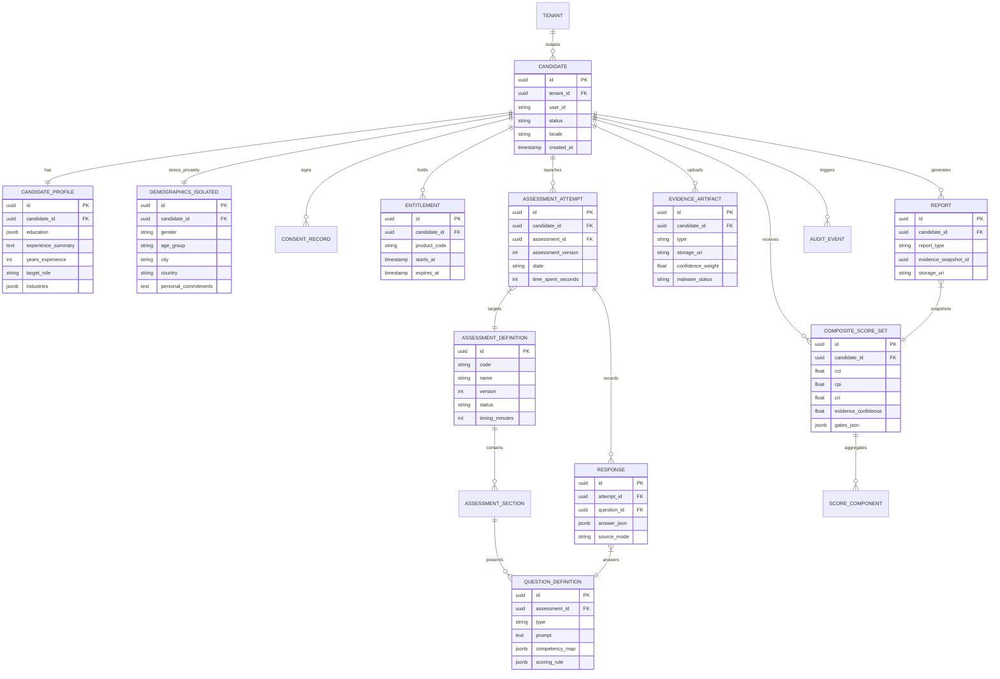
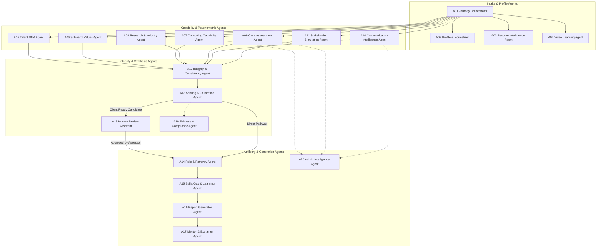
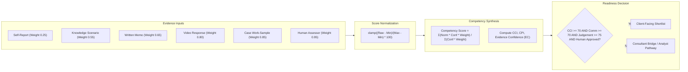

# METI Platform: Data Models, Knowledge Graph & Multi-Agent Specifications
## Database Schemas, Cypher Ontologies & AI Agent Contracts (A01–A20)

---

## 1. Relational Database Schema & Entity Relationship Diagram (PostgreSQL)



### 1.1 Relational DDL Specification
```sql
-- Core Candidate & Tenancy Entities
CREATE TABLE candidates (
    id UUID PRIMARY KEY DEFAULT gen_random_uuid(),
    tenant_id UUID NOT NULL,
    user_id VARCHAR(128) NOT NULL UNIQUE,
    enterprise_id VARCHAR(64),
    status VARCHAR(32) NOT NULL DEFAULT 'ACTIVE',
    locale VARCHAR(10) NOT NULL DEFAULT 'en-US',
    created_at TIMESTAMP WITH TIME ZONE DEFAULT CURRENT_TIMESTAMP,
    updated_at TIMESTAMP WITH TIME ZONE DEFAULT CURRENT_TIMESTAMP
);

CREATE TABLE candidate_profiles (
    id UUID PRIMARY KEY DEFAULT gen_random_uuid(),
    candidate_id UUID NOT NULL REFERENCES candidates(id) ON DELETE CASCADE,
    education JSONB NOT NULL DEFAULT '[]',
    experience_summary TEXT,
    years_experience INT DEFAULT 0,
    target_role VARCHAR(64),
    industries JSONB NOT NULL DEFAULT '[]',
    markets JSONB NOT NULL DEFAULT '[]',
    links JSONB NOT NULL DEFAULT '[]',
    created_at TIMESTAMP WITH TIME ZONE DEFAULT CURRENT_TIMESTAMP
);

-- Demographics Table (Strictly isolated from AI scoring feature vectors)
CREATE TABLE candidate_demographics_isolated (
    id UUID PRIMARY KEY DEFAULT gen_random_uuid(),
    candidate_id UUID NOT NULL UNIQUE REFERENCES candidates(id) ON DELETE CASCADE,
    gender VARCHAR(32),
    age_group VARCHAR(32),
    city VARCHAR(64),
    country VARCHAR(64),
    personal_commitments TEXT,
    support_requirements TEXT,
    created_at TIMESTAMP WITH TIME ZONE DEFAULT CURRENT_TIMESTAMP
);

CREATE TABLE consent_records (
    id UUID PRIMARY KEY DEFAULT gen_random_uuid(),
    candidate_id UUID NOT NULL REFERENCES candidates(id) ON DELETE CASCADE,
    consent_type VARCHAR(64) NOT NULL,
    version VARCHAR(32) NOT NULL,
    granted_at TIMESTAMP WITH TIME ZONE DEFAULT CURRENT_TIMESTAMP,
    withdrawn_at TIMESTAMP WITH TIME ZONE,
    source_ip_hash VARCHAR(128) NOT NULL
);

-- Assessment Definitions & Versioning
CREATE TABLE assessment_definitions (
    id UUID PRIMARY KEY DEFAULT gen_random_uuid(),
    tenant_id UUID, -- NULL denotes global shared baseline
    code VARCHAR(32) NOT NULL, -- e.g., 'F01', 'F06'
    name VARCHAR(128) NOT NULL,
    version INT NOT NULL DEFAULT 1,
    status VARCHAR(32) NOT NULL DEFAULT 'PUBLISHED', -- 'DRAFT', 'PUBLISHED', 'ARCHIVED'
    timing_minutes INT,
    scoring_profile_id UUID,
    UNIQUE(code, version)
);

CREATE TABLE question_definitions (
    id UUID PRIMARY KEY DEFAULT gen_random_uuid(),
    assessment_id UUID NOT NULL REFERENCES assessment_definitions(id),
    version INT NOT NULL DEFAULT 1,
    type VARCHAR(32) NOT NULL, -- 'QT01_SINGLE_CHOICE' .. 'QT15_DECLARATION'
    prompt TEXT NOT NULL,
    options_json JSONB,
    competency_map JSONB NOT NULL, -- e.g. [{"competency": "C01", "weight": 1.0}]
    scoring_rule JSONB NOT NULL,
    sensitivity_class VARCHAR(32) NOT NULL DEFAULT 'STANDARD'
);

-- Attempts & Response Persistence
CREATE TABLE assessment_attempts (
    id UUID PRIMARY KEY DEFAULT gen_random_uuid(),
    candidate_id UUID NOT NULL REFERENCES candidates(id),
    assessment_id UUID NOT NULL REFERENCES assessment_definitions(id),
    assessment_version INT NOT NULL,
    started_at TIMESTAMP WITH TIME ZONE DEFAULT CURRENT_TIMESTAMP,
    completed_at TIMESTAMP WITH TIME ZONE,
    state VARCHAR(32) NOT NULL DEFAULT 'IN_PROGRESS',
    time_spent_seconds INT DEFAULT 0
);

CREATE TABLE responses (
    id UUID PRIMARY KEY DEFAULT gen_random_uuid(),
    attempt_id UUID NOT NULL REFERENCES assessment_attempts(id) ON DELETE CASCADE,
    question_id UUID NOT NULL REFERENCES question_definitions(id),
    answer_json JSONB NOT NULL,
    submitted_at TIMESTAMP WITH TIME ZONE DEFAULT CURRENT_TIMESTAMP,
    source_mode VARCHAR(32) NOT NULL DEFAULT 'STANDARD'
);

-- Evidence & Media Artifacts
CREATE TABLE evidence_artifacts (
    id UUID PRIMARY KEY DEFAULT gen_random_uuid(),
    candidate_id UUID NOT NULL REFERENCES candidates(id),
    type VARCHAR(32) NOT NULL,
    storage_uri VARCHAR(512) NOT NULL,
    checksum VARCHAR(128) NOT NULL,
    provenance VARCHAR(64) NOT NULL,
    confidence_weight FLOAT DEFAULT 0.85,
    malware_status VARCHAR(32) NOT NULL DEFAULT 'CLEAN'
);

-- Composite Scores & Reports
CREATE TABLE composite_score_sets (
    id UUID PRIMARY KEY DEFAULT gen_random_uuid(),
    candidate_id UUID NOT NULL REFERENCES candidates(id),
    scoring_profile_version VARCHAR(32) NOT NULL,
    cci FLOAT NOT NULL, -- Consulting Capability Index (0-100)
    cpi FLOAT NOT NULL, -- Consulting Potential Index (0-100)
    cri FLOAT NOT NULL, -- Client Readiness Index (0-100)
    evidence_confidence FLOAT NOT NULL, -- (0-100)
    development_gap FLOAT NOT NULL,
    gates_json JSONB NOT NULL,
    created_at TIMESTAMP WITH TIME ZONE DEFAULT CURRENT_TIMESTAMP
);

CREATE TABLE reports (
    id UUID PRIMARY KEY DEFAULT gen_random_uuid(),
    candidate_id UUID NOT NULL REFERENCES candidates(id),
    report_type VARCHAR(32) NOT NULL,
    version VARCHAR(32) NOT NULL,
    evidence_snapshot_id UUID NOT NULL,
    storage_uri VARCHAR(512) NOT NULL,
    generated_at TIMESTAMP WITH TIME ZONE DEFAULT CURRENT_TIMESTAMP
);

CREATE TABLE entitlements (
    id UUID PRIMARY KEY DEFAULT gen_random_uuid(),
    candidate_id UUID NOT NULL REFERENCES candidates(id),
    product_code VARCHAR(32) NOT NULL,
    starts_at TIMESTAMP WITH TIME ZONE DEFAULT CURRENT_TIMESTAMP,
    expires_at TIMESTAMP WITH TIME ZONE,
    source VARCHAR(64) NOT NULL
);
```

---

## 2. Neo4j Knowledge Graph Ontology & Cypher Patterns

```mermaid
graph LR
    subgraph CoreNodes["Ontology Entities"]
        Cand["(:Candidate {id})"]
        Evid["(:EvidenceArtifact {type, confidence})"]
        Comp["(:Competency {code, name})"]
        Role["(:Role {title, target_vector})"]
        Val["(:BasicValue {name, higher_order})"]
        Mod["(:LearningModule {id, estimated_hours})"]
        Rubric["(:RubricDefinition {version})"]
    end

    Cand -->|HAS_EVIDENCE| Evid
    Evid -->|DEMONSTRATES {score}| Comp
    Evid -->|EVALUATED_AGAINST| Rubric
    Comp -->|REQUIRED_FOR {target_level}| Role
    Cand -->|MATCHES {fit_score}| Role
    Cand -->|HAS_VALUE_PRIORITY {centered_score}| Val
    Comp -->|DEVELOPED_BY| Mod
    Mod -->|BRIDGES_GAP_FOR| Role
```

### 2.1 Essential Cypher Ingestion & Query Patterns
```cypher
// Ingest Demonstrated Evidence Linked to a Competency
MATCH (c:Candidate {id: $candidateId})
CREATE (e:EvidenceArtifact {
    id: $artifactId, 
    type: $artifactType, 
    confidence: $confidenceWeight, 
    timestamp: datetime()
})
CREATE (c)-[:HAS_EVIDENCE]->(e)
WITH e
MATCH (comp:Competency {code: $competencyCode})
CREATE (e)-[:DEMONSTRATES {
    score: $normScore, 
    rubricVersion: $rubricVer
}]->(comp);

// Match Candidate Competency Vector against Target Role Requirements
MATCH (c:Candidate {id: $candidateId})-[:HAS_EVIDENCE]->(e:EvidenceArtifact)-[d:DEMONSTRATES]->(comp:Competency)
MATCH (r:Role {id: $targetRoleId})-[req:REQUIRES]->(comp)
WITH comp.code AS competency, 
     req.targetLevel AS requiredLevel,
     sum(d.score * e.confidence) / sum(e.confidence) AS estimatedScore
RETURN competency, requiredLevel, estimatedScore, (requiredLevel * 25 - estimatedScore) AS gap
ORDER BY gap DESC;
```

---

## 3. Multi-Agent System Network & Orchestration Map (A01–A20)



---

## 4. Psychometric & Scoring Mathematical Formulations



### 4.1 Implementation Code
```python
def calculate_question_score(raw: float, min_val: float, max_val: float) -> float:
    """Clamps and normalizes a question score to a 0-100 continuous scale."""
    if max_val == min_val:
        return 0.0
    return max(0.0, min(100.0, ((raw - min_val) / (max_val - min_val)) * 100.0))

def calculate_competency_score(evidence_items: list[dict]) -> float:
    """Computes a competency score weighted by the evidence confidence rating."""
    numerator = sum(item['norm_score'] * item['confidence'] * item['weight'] for item in evidence_items)
    denominator = sum(item['confidence'] * item['weight'] for item in evidence_items)
    return numerator / denominator if denominator > 0 else 0.0

def calculate_schwartz_centered_values(raw_values: dict[str, float]) -> dict[str, float]:
    """Calculates ipsative centered Schwartz values: Centered = Raw - MRAT."""
    mrat = sum(raw_values.values()) / len(raw_values)
    return {val_name: round(score - mrat, 3) for val_name, score in raw_values.items()}

def evaluate_client_readiness(
    cci: float, 
    comm_score: float, 
    judgement_score: float, 
    evidence_confidence: float, 
    has_critical_flags: bool, 
    human_approved: bool
) -> bool:
    """Determines whether a candidate passes the Client Readiness Gate."""
    return (
        cci >= 70.0 and
        comm_score >= 70.0 and
        judgement_score >= 75.0 and
        evidence_confidence >= 65.0 and
        not has_critical_flags and
        human_approved
    )
```
