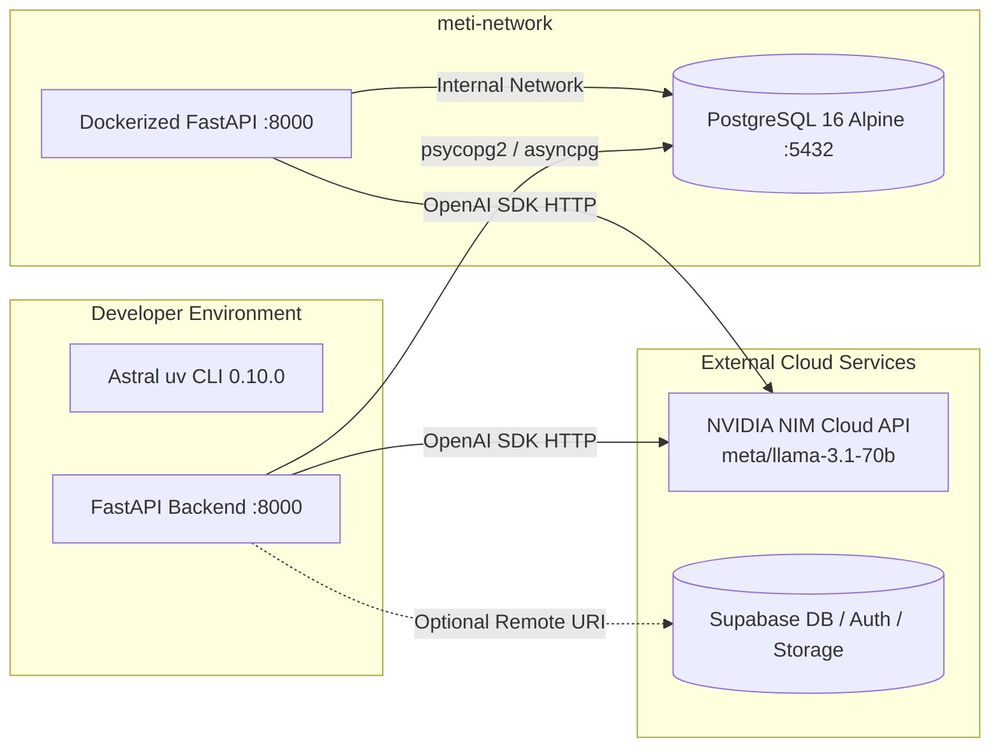

# METI Backend Engineering Execution Plan (UV + Docker)

**Role:** Lead Software Engineer  
**Objective:** Deliver an end-to-end, functional MVP backend for the METI platform adhering strictly to **METI TDD v1.1** and the **Master Backend Architecture Specification**.  
**Infrastructure Strategy:** **Hybrid UV + Docker** (Fastest local dependency execution via Astral `uv` + deterministic PostgreSQL containerization via `docker-compose`).

---

## 1. System Topology & Dual-Mode Execution



### Execution Modes
1. **Mode A (Fully Containerized):**
   ```bash
   docker compose up --build
   ```
   *Builds the FastAPI image using `uv` inside Docker, starts PostgreSQL 16, creates tables, runs seed script, exposes port 8000.*

2. **Mode B (Instant Local Development):**
   ```bash
   docker compose up -d db
   cd backend
   uv run uvicorn app.main:app --reload --port 8000
   ```
   *Uses host `uv` for sub-second startup and live reloading against the Dockerized PostgreSQL database.*

---

## 2. Detailed Engineering Tasks (Phased Breakdown)

### Phase 1: UV & Docker Infrastructure Setup
- [ ] **Task 1.1: Dependency Specification (`backend/pyproject.toml` & `backend/requirements.txt`)**
  - Define core dependencies: `fastapi>=0.110.0`, `uvicorn[standard]>=0.28.0`, `sqlalchemy>=2.0.28`, `psycopg2-binary>=2.9.9`, `pydantic>=2.6.4`, `pydantic-settings>=2.2.1`, `httpx>=0.27.0`, `openai>=1.14.0`, `python-dotenv>=1.0.1`.
- [ ] **Task 1.2: UV-Optimized Dockerfile (`backend/Dockerfile`)**
  - Use `ghcr.io/astral-sh/uv:latest` binary inside `python:3.11-slim`.
  - Install dependencies directly with `uv pip install --system -r requirements.txt`.
  - Configure unprivileged user, healthcheck, and entrypoint.
- [ ] **Task 1.3: Multi-Service Docker Compose (`docker-compose.yml`)**
  - Service `db`: `postgres:16-alpine`, port `5432`, volume `meti_postgres_data`, healthcheck via `pg_isready`.
  - Service `backend`: depends on `db` healthcheck, mounts `backend/` for hot-reload in dev, injects `.env` configuration.
- [ ] **Task 1.4: App Settings & Configuration (`backend/app/core/config.py`)**
  - Pydantic `BaseSettings` reading `DATABASE_URL`, `NVIDIA_API_KEY`, `NVIDIA_BASE_URL`, `NVIDIA_MODEL`, `SUPABASE_URL`, `SUPABASE_ANON_KEY`, `SUPABASE_SERVICE_ROLE_KEY`.

---

### Phase 2: Database Layer & Relational Domain Models
- [ ] **Task 2.1: Session & Declarative Base (`backend/app/db/session.py`, `backend/app/db/base.py`)**
  - SQLAlchemy 2.0 engine with connection pooling (`pool_pre_ping=True`).
  - Common mixins: `id` (UUID or prefixed string), `tenant_id`, `created_at`, `updated_at`.
- [ ] **Task 2.2: Candidate & Identity Models (`backend/app/models/candidate.py`)**
  - `Candidate`: `id`, `tenant_id`, `email`, `display_name`, `status`, `target_role`.
  - `CandidateProfile`: `candidate_id`, `education`, `experience_years`, `current_role`, `target_level`.
  - `Consent`: `candidate_id`, `consent_type`, `version`, `granted_at`, `status`.
- [ ] **Task 2.3: Assessment Architecture Models (`backend/app/models/assessment.py`)**
  - `Assessment`: `id`, `code` (`MC-A`), `version` (`1.0`), `status` (`PUBLISHED`), `time_limit_seconds`.
  - `Section`: `id`, `assessment_id`, `order_index`, `title`, `description`.
  - `Question`: `id`, `section_id`, `code`, `type` (`QT01` to `QT15`), `prompt`, `options` (JSONB), `scoring_rule` (JSONB), `competency_codes`.
- [ ] **Task 2.4: Runtime & Server Timer Models (`backend/app/models/attempt.py`)**
  - `Attempt`: `id`, `candidate_id`, `assessment_id`, `status` (`NOT_STARTED`, `IN_PROGRESS`, `PAUSED`, `SUBMITTED`), `started_at`, `expires_at`, `duration_seconds`, `locked_at`.
  - `Response`: `id`, `attempt_id`, `question_id`, `response_value` (JSONB), `saved_at`, `is_final`.
- [ ] **Task 2.5: Consulting Case Models (`backend/app/models/case.py`)**
  - `CaseStudy`: `id`, `title` (OmniRetail $1.8B Case), `industry`, `brief`, `time_limit_minutes`.
  - `CaseAttempt`: `id`, `candidate_id`, `case_id`, `status`, `started_at`, `expires_at`.
  - `CaseDeliverables`: Structured storage for all 11 consulting artifacts (Issue Tree, Hypotheses, 90-Day Roadmap, etc.).
- [ ] **Task 2.6: Scoring, Calibration & Audit Models (`backend/app/models/score.py`, `backend/app/models/audit.py`)**
  - `ScoreRecord`: `attempt_id`, `candidate_id`, `cci`, `cpi`, `cri`, `evidence_confidence`, `development_gap`, `role_match_score`, `is_client_ready`.
  - `ScoreComponent`: Competency-level breakdown (C01–C20) with raw, normalized, and confidence metrics.
  - `AssessorReview`: `attempt_id`, `reviewer_id`, `original_score`, `final_score`, `override_applied`, `reason`.
  - `AuditEvent`: Append-only audit record for all score changes and status progressions.

---

### Phase 3: Domain Engines & Algorithmic Services
- [ ] **Task 3.1: Server-Authoritative Assessment Engine (`backend/app/services/assessment_engine.py`)**
  - Validate state machine transitions.
  - Compute authoritative server timers (`remaining_seconds`, `is_expired`).
  - Enforce submission locking (reject writes after expiration or submission).
- [ ] **Task 3.2: TDD v1.1 Scoring Engine (`backend/app/services/scoring_engine.py`)**
  - Implement Evidence Confidence weights ($0.25$ self-report, $0.50$ prior work, $0.85$ case work-sample, $0.90$ video, $1.00$ assessor).
  - Compute **CCI** (Consulting Capability Index across C01–C20).
  - Compute **CPI** (Consulting Potential Index).
  - Compute **CRI** (Client Readiness Index) with ethical and risk gating.
  - Generate development gaps and target role match.
- [ ] **Task 3.3: NVIDIA NIM LLM Evaluator (`backend/app/services/llm_evaluator.py`)**
  - OpenAI-compatible client targeting `https://integrate.api.nvidia.com/v1` with model `meta/llama-3.1-70b-instruct`.
  - Prompts specifically tailored for consulting evaluation:
    1. Issue Tree MECE soundness & depth
    2. Quantitative and hypothesis rigor
    3. Actionable executive recommendations
  - **Graceful Fallback:** Automatic switch to deterministic rule evaluator if `NVIDIA_API_KEY` is not provided or API is unreachable.
- [ ] **Task 3.4: Assessor Calibration Service (`backend/app/services/assessor_service.py`)**
  - Process assessor overrides.
  - Enforce mandatory written justification (`reason` cannot be empty).
  - Emit immutable `AuditEvent`.

---

### Phase 4: REST API Endpoints (`/api/v1`)
- [ ] **Task 4.1: Health & System Diagnostics (`/health`)**
  - Verify DB connection and return service status.
- [ ] **Task 4.2: Candidate Endpoints (`/api/v1/candidates`)**
  - `GET /me`: Candidate profile & active target role.
  - `GET /me/dashboard`: Aggregated progress, completed assessments, and pending actions.
- [ ] **Task 4.3: Assessment & Attempt Endpoints (`/api/v1/assessments`, `/api/v1/attempts`)**
  - `GET /assessments/active`: Retrieve published `MC-A v1.0` definition.
  - `POST /assessments/{id}/attempts`: Start attempt, initialize timer.
  - `GET /attempts/{id}`: Fetch state, current section, saved answers, and remaining time.
  - `PUT /attempts/{id}/responses/{qid}`: Idempotent autosave response endpoint.
  - `POST /attempts/{id}/submit`: Lock attempt, trigger scoring engine.
- [ ] **Task 4.4: Consulting Case Endpoints (`/api/v1/cases`)**
  - `GET /cases/{id}`: Case brief & data pack.
  - `POST /cases/{id}/attempts`: Start timed 45-min case.
  - `PUT /case-attempts/{id}`: Autosave deliverables.
  - `POST /case-attempts/{id}/submit`: Submit deliverables, trigger NVIDIA NIM rubric grading.
- [ ] **Task 4.5: Scores & Reports Endpoints (`/api/v1/scores`, `/api/v1/roadmap`)**
  - `GET /candidates/me/scores`: Authoritative CCI, CPI, CRI, confidence, and radar breakdown.
  - `GET /candidates/me/roadmap`: Personalized 3-phase development roadmap.
- [ ] **Task 4.6: Assessor Endpoints (`/api/v1/assessor`)**
  - `GET /reviews`: Review queue of submitted candidate attempts.
  - `POST /reviews/{id}/override`: Submit calibrated score with audit reason.

---

### Phase 5: Deterministic Data Seeding (`backend/app/db/seed.py`)
- [ ] **Task 5.1: Sarah Jenkins Demo Dossier**
  - Preload demo candidate: Sarah Jenkins (Senior Consultant targeting Enterprise Transformation Consultant).
- [ ] **Task 5.2: Assessment MC-A v1.0 Definition**
  - Preload sections: Problem Solving, Operating Model & TOM, Financial Rigor, Executive Presence.
  - Preload QT01–QT05 question items with competency mappings.
- [ ] **Task 5.3: OmniRetail Transformation Case Study**
  - Preload case brief, financial exhibits, and evaluation rubric.

---

### Phase 6: Docker Launch & Verification
- [ ] **Task 6.1: Build & Launch Multi-Container Stack**
  - Execute `docker compose up --build -d`.
  - Check container health status via `docker compose ps`.
- [ ] **Task 6.2: End-to-End API Integration Testing**
  - Run verification script checking:
    1. Health check `GET /health` $\rightarrow$ `200 OK`
    2. Start Attempt $\rightarrow$ Autosave responses $\rightarrow$ Submit
    3. Calculate scores (CCI, CPI, CRI)
    4. Start OmniRetail Case $\rightarrow$ Submit deliverables $\rightarrow$ LLM evaluation
    5. Assessor review $\rightarrow$ Override with rationale $\rightarrow$ Check audit log
- [ ] **Task 6.3: Frontend Connection Alignment**
  - Configure CORS origins for `http://localhost:5173`.
  - Validate OpenAPI documentation at `http://localhost:8000/docs`.

---

## 3. Definition of Done (DoD)
1. Both containers (`db` and `backend`) launch cleanly with `docker compose up --build`.
2. Host `uv run` works flawlessly for local development.
3. All TDD v1.1 scoring formulas (CCI, CPI, CRI, Evidence Confidence) are verified with unit tests.
4. NVIDIA NIM evaluation is connected with automatic, graceful fallback to deterministic rules.
5. All REST endpoints return typed Pydantic JSON contracts matching the frontend requirements.
