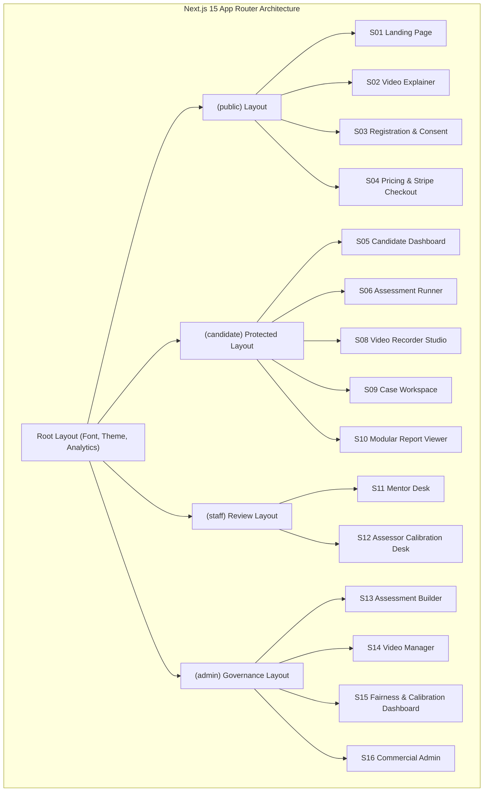
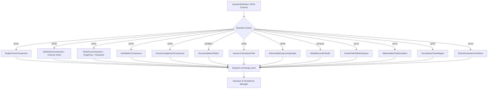
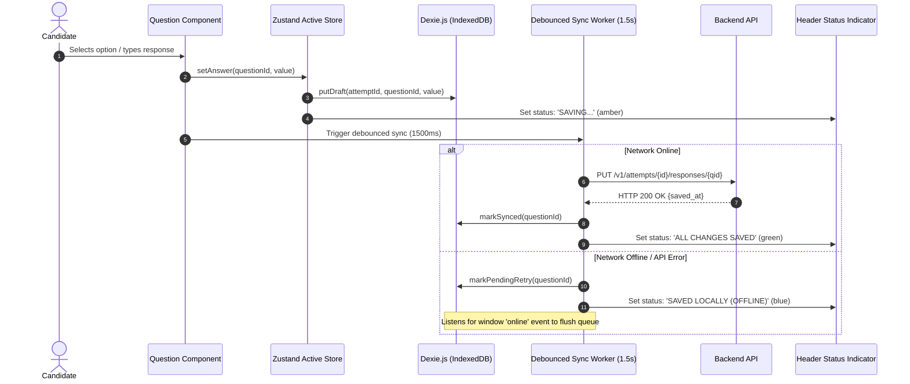
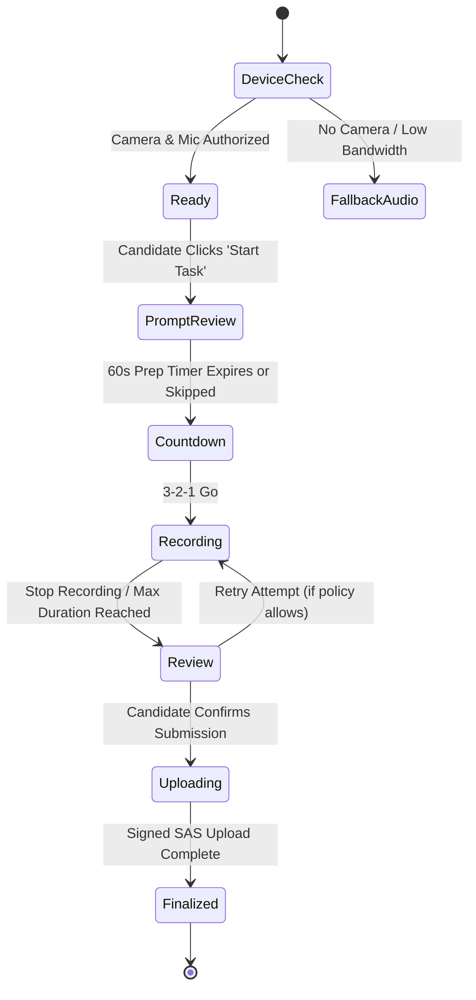
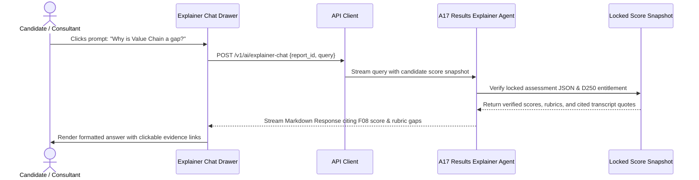

# METI Platform: Comprehensive Frontend Architecture
## Client Experience, Component Engineering & Visual Design System

---

## 1. Frontend System Design & Architectural Patterns

The METI frontend is engineered as a high-reliability, responsive web application using **Next.js 15 (App Router)**, **React 19**, **TypeScript**, and **Tailwind CSS + ShadCN UI**. It prioritizes sub-second interaction latency, resilient offline-first autosaving, and WCAG 2.2 AA accessibility.



---

## 2. Dynamic Assessment Engine & Question Factory (QT01–QT15)

The assessment runner (`S06`) dynamically renders items from forms `F01` to `F22` through an extensible **Question Factory Component**:



### 2.1 Ranked Trade-Off Component (QT03 - S07)
* **Design Purpose:** Used in Talent DNA (F04) to eliminate "all high ratings" by forcing rank assignments (1st, 2nd, 3rd, 4th).
* **Accessible Implementation:** Built with `@dnd-kit/core` for fluid mouse drag-and-drop, paired with dedicated accessible Up/Down buttons and full keyboard navigation (`Space/Enter` to select, `ArrowUp/ArrowDown` to swap).
* **Validation:** Prevents duplicate rank states; locks submit until all 4 options occupy a unique priority rank.

---

## 3. Resilient Autosave & Local State Architecture

Candidates cannot lose progress due to connectivity drops, accidental tab closures, or power loss:



---

## 4. Video & Audio Response Studio (S08 / QT10)



* **Hardware Pre-flight Check:** Verifies video feed, microphone levels (visualized via a live Web Audio API volume bar), and network upload bandwidth.
* **Stream Capture:** Encodes via `MediaRecorder` at $720\text{p} / 30\text{fps}$ in WebM/MP4 container format.
* **Zero-Burden Upload:** Files stream directly from the browser to Azure Blob Storage via signed chunked URLs, avoiding server gateway memory limits.

---

## 5. Consulting Case Workspace (S09 / QT12)

Designed specifically for desktop and tablet viewports to emulate real-world consulting problem-solving:

```
┌────────────────────────────────────────┬────────────────────────────────────────┐
│ LEFT PANEL: Case Dossier & Exhibits    │ RIGHT PANEL: Consulting Deliverable    │
├────────────────────────────────────────┼────────────────────────────────────────┤
│ [Case Brief] [Exhibits] [Financials]   │ [1. Problem Def] [2. Hypotheses]       │
│                                        │ [3. Options]     [4. Recommendation]   │
│ Client: Global Retail Group            │                                        │
│ Situation: 18% margin compression      │ ┌────────────────────────────────────┐ │
│ Objective: Identify supply bottlenecks │ │ 1. Structured Executive Memo       │ │
│                                        │ │ (Pyramid Principle: Headline first)│ │
│ Interactive Exhibit Viewer:            │ │                                    │ │
│ • Multi-year revenue & margin tables   │ │ 2. Decision Logic & Trade-offs     │ │
│ • Supply chain flow diagram (SVG)      │ │                                    │ │
│ • Downloadable raw data (.xlsx)        │ │ 3. First 90-Day Implementation Plan│ │
│                                        │ └────────────────────────────────────┘ │
│ Timer: [ 00:42:15 Remaining ]          │ File Attachment: [ Upload Deck / Map ] │
│ AI Mode: [ Closed AI Examination ]     │ Autosave: [ All Changes Saved ]        │
└────────────────────────────────────────┴────────────────────────────────────────┘
```

---

## 6. Visual Intelligence & Report Generation System (S10)

The candidate report employs high-impact, executive-grade data visualizations:

### 6.1 Radar Chart: 20 Consulting Competencies (C01–C20)
Built with **Recharts**, plotting 20 axes divided into 4 strategic clusters:
1. *Strategy & Analysis* (C01, C02, C03, C04, C05)
2. *Architecture & Transformation* (C06, C07, C08, C09, C10, C11, C12)
3. *Problem Structuring & Logic* (C13, C14, C15, C16)
4. *Judgement & Adaptability* (C17, C18, C19, C20)

### 6.2 Schwartz-Informed Values Circumplex (D3.js)
* Visualizes 10 basic values along a polar circumplex.
* Values are color-coded by the four higher-order meta-dimensions:
  * **Openness to Change** (Blue: Self-direction, Stimulation)
  * **Self-Enhancement** (Amber: Achievement, Power)
  * **Conservation** (Green: Security, Conformity, Tradition)
  * **Self-Transcendence** (Purple: Benevolence, Universalism)
* Shows **ipsative centered bars** with zero-line divergence, emphasizing relative priority over absolute magnitude.

### 6.3 16-Week Dynamic Development Roadmap (Gantt Component)
* Interactive timeline rendering Phase 1 (Foundations), Phase 2 (Application & Bridge Projects), and Phase 3 (Case Mastery & Client Simulation).
* Milestone cards feature direct links to learning modules, case assignments, and reassessment booking triggers.

---

## 7. Interactive AI Results Explainer Drawer

Embedded in the report screen (`S10`) to provide instant, conversational score clarity:



---

## 8. Accessibility & Compliance (WCAG 2.2 AA)

1. **Color Contrast & Semantic Hierarchy:** Minimum contrast ratio of $4.5:1$ for normal text and $3:1$ for graphics; no information conveyed solely through color (all scores pair color chips with numeric values and level labels).
2. **Keyboard Traversal:** Complete keyboard operability across all widgets (drag/drop rank questions, video controls, tabbed case exhibits, and modals).
3. **Screen Reader Support:** Full ARIA role attribution, live region updates for autosave feedback, and explicit image/chart descriptions.
4. **Accessible Equivalents:** "Read transcript instead" mode available for all required videos (V01, V02) with knowledge check bypass validation.
