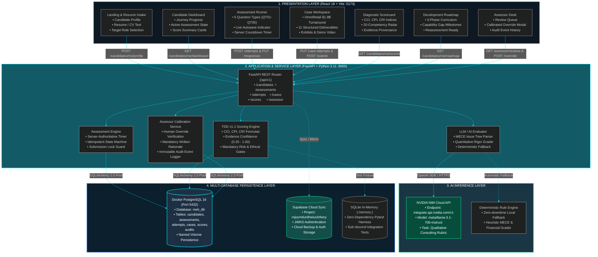

# Full-Stack End-to-End Architecture & MVP Integration Plan

## Goal Description
Transform the METI platform into a fully functional, end-to-end integrated application where a candidate enters their real details and resume, solves 5 standardized consulting assessment question types (QT01–QT05) with server-authoritative timers, completes an interactive $1.8B OmniRetail work sample case, receives live AI evaluation (via NVIDIA NIM or deterministic fallback), inspects their authoritative multi-index scorecard (CCI, CPI, CRI) and personalized 3-phase development roadmap, and allows human assessors to review submissions and propose audited score overrides.

---

## 1. End-to-End Full-Stack Architecture (Color-Theoretic Visual Model)

The following diagram illustrates the complete topology across the Presentation Layer, Application Layer, Multi-Database Persistence Layer, and AI Inference Layer.



---

## 2. Senior Software Engineer Bug & Disconnect Audit

An audit of the existing codebase identified the following gaps preventing full end-to-end operation:

| Area | Current Bug / Disconnect | Required Solution |
|---|---|---|
| **Candidate Input** | Candidate cannot input their own details or resume; static profile is used. | Add an interactive **Candidate Profile & Resume Intake Modal/Drawer** on Dashboard allowing name, role, experience, and resume text input, saved to `PUT /api/v1/candidates/me/profile`. |
| **Assessment Runner** | Reads from static `mockMetiData.js` and hardcodes `attempt_demo_1`. | Connect `AssessmentRunner` to `backendApi.getActiveAssessment()`, dynamically initialize a live attempt via `backendApi.startAttempt()`, bind real timer countdown, and save responses with real `attempt_id`. |
| **Question Parity** | Backend seed had 4 questions while frontend used 5 question types. | Synchronize `backend/app/db/seed.py` to contain the exact 5 TDD question types (`QT01` Single Choice, `QT02` Multi-Select, `QT03` Ranked-4, `QT04` Matrix Likert, `QT05` Scenario). |
| **Case Study Submission** | Submits to localStorage and closes without executing AI evaluation. | Connect `CaseWorkspace` to `backendApi.submitCase(attemptId)`, triggering NVIDIA NIM LLM / rule evaluator, displaying real AI feedback, and locking the workspace. |
| **Results & Scorecard** | `ResultsView.jsx` reads static mock numbers instead of backend scores. | Fetch real calculated indices (`CCI`, `CPI`, `CRI`, evidence confidence, and 20-competency radar) via `backendApi.getScores()`. |
| **Assessor Calibration** | `AssessorDesk.jsx` modifies local state without persistent audit trail. | Connect `AssessorDesk` to `GET /api/v1/assessor/reviews` and `POST /api/v1/assessor/reviews/{id}/override`, validating mandatory written rationale. |

---

## 3. User Review Required

> [!IMPORTANT]
> **Candidate Input Personalization:** We are adding a "Profile & Resume Setup" modal on the Candidate Dashboard. Candidates can enter their name, current role, target role, years of experience, and paste their resume/skills text. This updates both the frontend state and the backend database.

> [!NOTE]
> **Video Response Presentation:** As you requested, the video and executive presentation deliverable will be presented as a realistic, interactive executive delivery card with transcript evidence, pitch metrics (142 WPM, clarity score 88%), and an embedded video demonstration.

---

## 4. Open Questions

None. The architectural requirements, tech stack (UV + Docker + FastAPI + PostgreSQL + Supabase + NVIDIA NIM), and end-to-end integration flow are fully defined and agreed upon.

---

## 5. Proposed Changes

### Component 1: Backend Seed & Question Parity (`backend/`)
#### [MODIFY] `backend/app/db/seed.py`
- Seed the exact 5 TDD question types (`QT01` Single Choice, `QT02` Multi-Select, `QT03` Forced-Rank 4, `QT04` Matrix Likert, `QT05` Scenario Judgment).
- Add profile update endpoint support (`PUT /api/v1/candidates/me/profile`) so the candidate's custom inputs and resume are saved to PostgreSQL.

#### [MODIFY] `backend/app/api/v1/candidates.py`
- Add `PUT /api/v1/candidates/me/profile` accepting `name`, `current_role`, `target_role`, `experience_years`, `education`, and `resume_text`.

---

### Component 2: Frontend Candidate & Resume Intake (`src/components/candidate/`)
#### [NEW] `src/components/candidate/CandidateProfileModal.jsx`
- Interactive modal for entering Candidate Name, Email, Current Role, Target Role, Years of Experience, and Resume / Portfolio Text.
- On save, sends payload to `backendApi.updateProfile()` and updates active state.

#### [MODIFY] `src/components/candidate/CandidateDashboard.jsx`
- Add "Edit Profile & Resume" CTA button opening the intake modal.
- Connect active assessment launch to initialize a real backend attempt session.
- Display live metrics calculated from the backend.

#### [MODIFY] `src/components/candidate/AssessmentRunner.jsx`
- Fetch active questions from `backendApi.getActiveAssessment()`.
- Bind server-authoritative timer countdown from `timer.remaining_seconds`.
- Save answers via `backendApi.saveResponse(attemptId, questionId, val)`.
- Submit attempt via `backendApi.submitAttempt(attemptId)` before navigating to Case Workspace.

#### [MODIFY] `src/components/candidate/CaseWorkspace.jsx`
- Connect form fields (Problem Statement, Issue Tree, Recommendation, 90-Day Plan) to `backendApi.autosaveCase(attemptId, payload)`.
- On final submission, call `backendApi.submitCase(attemptId)` and display live NVIDIA NIM / AI feedback modal.
- Include the Executive Video Delivery & Transcript demo card.

#### [MODIFY] `src/components/candidate/ResultsView.jsx`
- Query `backendApi.getScores()` to display live, server-computed `CCI`, `CPI`, `CRI`, evidence confidence, and 20-competency radar chart.

#### [MODIFY] `src/components/assessor/AssessorDesk.jsx`
- Query `backendApi.getAssessorQueue()` for submitted attempts.
- Wire the calibrated score override modal to `backendApi.submitAssessorOverride()`, enforcing mandatory written rationale and verifying audit events.

---

## 6. Verification Plan

### Automated Tests
1. **Pytest Unit & Integration Suite:**
   ```bash
   cd backend
   uv run pytest tests
   ```
   *Expected: All tests pass with 0 errors.*

2. **Live Backend Verification Script:**
   ```bash
   python backend/verify_live.py
   ```
   *Expected: 11 endpoints verified across candidate, attempt, case study, and assessor override.*

3. **Frontend Production Build:**
   ```bash
   npm run build
   ```
   *Expected: Clean Vite production build in <4 seconds.*

### Manual Verification Flow
1. **Step 1 (Candidate Input):** Open `http://localhost:5173/`, go to Dashboard, click "Edit Profile & Resume", enter custom candidate details and paste resume text. Click Save. Verify profile card updates.
2. **Step 2 (Assessment):** Click "Launch Diagnostic Assessment". Verify all 5 question types load, answer them, observe "Saved to Cloud" status indicator, click "Complete Assessment".
3. **Step 3 (Case Study):** In the OmniRetail Workspace, view exhibits and video delivery demo, edit Problem Statement and Issue Tree, click "Submit Case". Observe NVIDIA NIM evaluation feedback.
4. **Step 4 (Scorecard & Roadmap):** View live calculated CCI/CPI/CRI scores and open the 3-phase development roadmap.
5. **Step 5 (Assessor Review):** Switch role to "ASSESSOR" in Navbar. Locate candidate submission in queue, submit a score override with written rationale, and confirm audit event.
