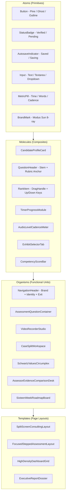

# METI Platform: Comprehensive UI/UX Requirements & Design Specification
## Grounded in TDD Sections (01–28, Appendices A–E) & Atomic UI/UX Design Skill

---

## 1. Executive Summary & Design System Foundation

### 1.1 Platform Identity & Intent
**METI (Modus Enterprise Talent Intelligence)** is an enterprise capability assessment, diagnostic intelligence, and executive development platform for business and management consulting readiness.

Following the **UI/UX Design Skill (`docs/ui/SKILL.md`)** and modern executive consulting benchmarks (**Korn Ferry** & **Thomas International**), the platform strictly rejects:
* Consumer "gamified" quiz/exam aesthetics (no bouncing icons, no generic countdown timers like "Question 17 of 50").
* Dark cyber-mode / neon-glow gradients.
* Cluttered or generic LMS / HR administration forms.
* Skeuomorphic or decorative device frames (screens are presented as pure digital surfaces).

Instead, METI is engineered as:
* **Style:** Modern Enterprise Executive — calm, authoritative, evidence-driven, transparent.
* **Layout Pattern:** 8pt rhythmic grid, F-pattern for data-heavy analyses, split-canvas for consulting cases, high data-density dashboards.
* **Core Paradigm:** **Assess → Understand → Develop → Reassess**. The system understands who the candidate is upfront before evaluating them.

---

### 1.2 Design Tokens & Visual Language

```
┌────────────────────────────────────────────────────────────────────────┐
│                        METI COLOR SYSTEM                               │
├──────────────────┬─────────────────┬─────────────────┬─────────────────┤
│ Pure Canvas      │ Deep Forest     │ Emerald Mint    │ Sage Slate      │
│ #FFFFFF          │ #0B3B36         │ #00B377         │ #3D6E66         │
│ Background &     │ Primary brand,  │ Interactive     │ Secondary       │
│ card surfaces    │ headers, text   │ actions, badges │ accents, borders│
└──────────────────┴─────────────────┴─────────────────┴─────────────────┘
```

#### Color Tokens
| Token | Value | Semantic Role | WCAG Ratio (vs #FFF) |
| :--- | :--- | :--- | :--- |
| `--bg-canvas` | `#FFFFFF` | Primary canvas & modal background | N/A |
| `--bg-surface-subtle` | `#F8FAFB` | Card surfaces, sidebar background, table headers | 1.05:1 |
| `--text-primary` | `#0B3B36` | Primary headings, titles, high-emphasis text | 12.8:1 (AAA) |
| `--text-body` | `#172321` | Standard body copy, readable prose | 14.1:1 (AAA) |
| `--text-muted` | `#52796F` | Secondary labels, timestamps, metadata | 4.8:1 (AA) |
| `--kf-pine` | `#0B3B36` | Authoritative buttons, active navigation markers | 12.8:1 (AAA) |
| `--kf-pine-hover` | `#05241F` | Button hover and pressed states | 16.4:1 (AAA) |
| `--kf-mint` | `#00B377` | Success indicators, verified badges, active accents | 4.6:1 (AA on dark) |
| `--kf-mint-subtle` | `#E8F8F2` | Pill backgrounds, active state fills | N/A |
| `--border-subtle` | `#E5EAE8` | Card dividers, input borders, table borders | N/A |
| `--border-focus` | `#00B377` | Focus ring for keyboard accessibility | 4.6:1 |
| `--status-warning` | `#B45309` | Time-sensitive warnings, calibration alerts | 5.2:1 (AA) |
| `--status-danger` | `#B91C1C` | Form validation errors, critical flags | 5.9:1 (AA) |

#### Typography System (Inter / Manrope Geometric Sans)
| Level | Font Size | Line Height | Weight | Tracking | Usage |
| :--- | :--- | :--- | :--- | :--- | :--- |
| **Display 01** | 36px (2.25rem) | 44px | 800 (Extrabold) | -0.025em | S01 Hero headline, Report covers |
| **Headline 01** | 28px (1.75rem) | 36px | 700 (Bold) | -0.02em | Section titles, Modal headers |
| **Headline 02** | 22px (1.375rem)| 28px | 600 (Semibold) | -0.015em | Module headers, Card titles |
| **Subhead** | 16px (1.00rem) | 24px | 500 (Medium) | -0.01em | Question stems, Guidance banners |
| **Body 01** | 15px (0.9375rem)| 22px | 400 (Regular) | 0 | Narrative responses, Exhibits |
| **Body 02 (Compact)**| 13px (0.8125rem)| 18px | 400 (Regular) | +0.01em | Table data, Tooltips, Rubric items |
| **Micro / Label** | 11px (0.6875rem)| 14px | 600 (Semibold) | +0.05em | Badges, Status pills, Category tags |

#### Spacing System (8pt Rhythm)
* `4px` (`space-1`): Micro-padding between badge icons and text.
* `8px` (`space-2`): Input padding, gap between compact metadata pills.
* `16px` (`space-4`): Form field vertical spacing, card inner padding (mobile).
* `24px` (`space-6`): Card inner padding (desktop), grid gap.
* `32px` (`space-8`): Section separation within assessment runner.
* `48px` (`space-12`): Major module dividers, dashboard card gap.
* `64px` (`space-16`): Screen vertical rhythm, landing hero padding.

---

## 2. Atomic Component Hierarchy (per UI Skill Protocol)



---

## 3. Screen-by-Screen Specification (S01 through S16)
*Traceable directly to Section 17 of the METI TDD.*

---

### S01: Landing & Orientation
* **Persona:** Prospective Candidate / Enterprise Sponsor
* **TDD Reference:** Section 5 (Stage 0A), Section 17 (S01), Section 6 (V01)
* **Intent & Layout:** F-pattern, clean hero split. 16:9 viewport ratio.
* **Atomic Components:**
  * *Atoms:* `ModusBrandMark`, `ButtonPrimary` ("Begin Capability Assessment →"), `MetricBadge` ("96% Fortune 50").
  * *Molecules:* `TrustBanner` (enterprise logos, privacy summary), `RoleTrackSelector` (Consulting Analyst, Transformation Lead, Strategy Associate).
  * *Organisms:* `HeroSection` (headline: *"We help businesses and the people in them thrive"*), `WhyModusGrid` (3-column benefits), `PrivacyDisclosureCard`.
* **State Behavior:**
  * Displays transparent assessment scope (~40 mins Stage 1, optional case & video).
  * Explicit CTA directs to Profile Initialization (`PersonalizedAssessmentStart`).

---

### S02: Video Explainer & Learning Experience
* **Persona:** Candidate (Pre-assessment)
* **TDD Reference:** Section 6 (V01–V10), Section 17 (S02)
* **Intent & Layout:** Centered focused media theater.
* **Atomic Components:**
  * *Atoms:* `PlayPauseToggle`, `TimeTracker`, `CaptionsToggle`, `VolumeSlider`, `SpeedSelector` (1x, 1.25x, 1.5x).
  * *Molecules:* `ChapterMarkersList` (Overview, Enterprise Thinking, Assessment Rules), `TranscriptScrollBox` (time-synced text).
  * *Organisms:* `ManagedVideoPlayer` (YouTube IFrame API / HTML5 HLS video), `KnowledgeCheckModal` (1–3 comprehension checks).
* **Interactive Logic & Heuristics:**
  * **80% Completion Gate:** The "Continue to Assessment" button remains disabled until candidate reaches 80% video progress or completes the transcript alternative.
  * **Accessible Alternative:** One-click *"Read Full Transcript Instead"* path allows immediate progression for screen-reader or low-bandwidth candidates without penalty.
  * **Knowledge Check:** Non-punitive check confirming the candidate understands that responses are evaluated on structured reasoning and evidence.

---

### S03: Registration, Identity & Ethical Consent
* **Persona:** Candidate
* **TDD Reference:** Section 7 (F01), Section 17 (S03), Section 22 (Security & Ethics)
* **Intent & Layout:** Single-column centered card (max-w-xl), minimal friction.
* **Atomic Components:**
  * *Atoms:* `InputField` (Name, Corporate Email, Mobile, Country), `CheckboxControl` (Individual consent checkboxes).
  * *Molecules:* `SSOButtonGroup` (LinkedIn, Google Workspace, Microsoft Enterprise), `ConsentDisclosureCard`.
* **Required Ethical Disclosures:**
  * Explicit consent for AI-assisted scoring and transcription analysis.
  * Statement of non-discrimination: No facial emotion analysis, no accent penalty, zero visual appearance scoring.
  * Data sovereignty and retention summary with right-to-erasure link.

---

### S04: Product Entitlement & Pricing Checkout
* **Persona:** Self-funded Candidate / Corporate Sponsor
* **TDD Reference:** Section 5 (Stage 1C, Stage 2A), Section 17 (S04), Section 21
* **Intent & Layout:** 2-Tier comparative pricing table with prominent feature matrix.
* **Tier Architecture:**
  1. **Core Capability Assessment (Included / Stage 1):** Diagnostic assessment, Capability Index, Executive Summary of findings.
  2. **Detailed Intelligence & 16-Week Roadmap ($250 USD):** Full 32-page report, C01–C20 capability radar, Schwartz Values Circumplex, detailed gap breakdown, personalized sprint learning plan.
* **Atomic Components:**
  * *Atoms:* `CurrencyBadge` ($ USD / £ GBP / € EUR), `PromoInput`, `StripeCardElement`.
  * *Molecules:* `EntitlementFeatureList`, `CorporateVoucherRedemptionBox`.

---

### S05: Candidate Dashboard & Journey Command Center
* **Persona:** Candidate
* **TDD Reference:** Section 5 (Stages 0A–4), Section 17 (S05)
* **Intent & Layout:** High-density 3-column enterprise executive dashboard.
* **Atomic Components:**
  * *Column 1 (Identity & Profile):* Candidate avatar, target role, education/domain badge, CV verification status.
  * *Column 2 (Active Journey Stepper):* Stage 1 Diagnostic → Case Challenge → Executive Video → Intelligence Report → Reassessment.
  * *Column 3 (Action Hub):* "Next Immediate Action" prominent card with estimated completion time (e.g., "Complete Scenario Trade-off — 8 mins remaining").

---

### S06: Adaptive Assessment Runner (Experience-Specific)
* **Persona:** Candidate
* **TDD Reference:** Section 7 (F02–F14), Section 17 (S06), Appendix B (QT01–QT15)
* **Intent & Layout:** Calm, focused assessment canvas with zero peripheral clutter.
* **Screen Structure:**
  * **Top Bar:** Modus brand mark, Module title (e.g., *"Strategy & Enterprise Problem Framing"*), Step indicator (*"Section 2 of 4"* — sections, never confusing item counts), `AutosaveIndicator` (*"Saved ✓"* in green).
  * **Context Banner:** Experience-adaptive grounding banner (*"Grounding based on your background in AI & Video Analytics..."*).
  * **Question Workspace:** Dynamic question container rendering the exact QT component.
  * **Footer Action Bar:** `Save & Exit` (secondary ghost), `Next Section →` (pine green button).
* **Autosave Guarantee:**
  * Debounced 400ms autosave to backend API and immediate local state mirroring.
  * Uninterrupted offline caching in `localStorage` in case of temporary Wi-Fi drop.

---

### S07: Ranked Trade-Off Component (QT03)
* **Persona:** Candidate
* **TDD Reference:** Section 7 (F04 Talent DNA, F05 Schwartz Values), Section 17 (S07), Appendix B (QT03)
* **Design Purpose:** Eliminates "all-high ratings" acquiescence bias by forcing relative prioritization (1st, 2nd, 3rd, 4th priority).
* **Component Architecture:**
  * **Interactive Mouse Drag:** Powered by `@dnd-kit/core` with smooth vertical spring translation.
  * **Keyboard Accessibility:** Each item features dedicated `↑` and `↓` micro-buttons. Candidates can tab into items and use `ArrowUp` / `ArrowDown` to swap positions.
  * **Visual Feedback:** Numbered priority badge (1, 2, 3, 4) in Pine Green with subtle pill elevation.
  * **Validation:** Prevents form progression until all 4 options are uniquely ordered.

---

### S08: Video Recorder & Executive Presence Studio
* **Persona:** Candidate
* **TDD Reference:** Section 11 (Rubric & Technical Flow), Section 17 (S08), Appendix B (QT10)
* **Layout:** 2-Column Split: Left = Prompt, Constraints & Prep Timer; Right = Video Studio & Real-time Telemetry.
* **Detailed Flow & Safeguards:**
  1. **Device Check:** Verifies camera, microphone levels, and network latency before start.
  2. **Preparation Phase:** 60-second prep countdown timer with optional *"Start Recording Now"* bypass.
  3. **Recording Phase:**
     * Maximum recording duration (default 3 minutes).
     * Live **Word Count & Cadence Meter** (calibrated to the 130–155 WPM executive standard).
     * Real-time audio waveform level ensuring audibility.
  4. **Review & Retake:** Candidate can playback their recording, view the instant auto-generated transcript, and use one allowed re-take if unsatisfied.
  5. **Ethical AI Rubric Disclosure:** Visible banner stating: *"Evaluation is strictly based on pyramid logic, evidence structuring, and business clarity. Facial expressions, clothing, background, and accents are NEVER scored."*

---

### S09: Case Challenge & Work-Sample Workspace
* **Persona:** Candidate
* **TDD Reference:** Section 12 (Case & Work Sample), Section 17 (S09), Appendix B (QT12)
* **Layout:** Resizable Split-Screen Workspace:
  * **Left Panel (Case Pack & Exhibits):**
    * Tabbed exhibits: *Exhibit 1: Client Financials*, *Exhibit 2: Value Chain Bottlenecks*, *Exhibit 3: Stakeholder Interview Extracts*.
    * Downloadable raw datasets (.xlsx / .csv).
    * Search & highlight within case documents.
  * **Right Panel (Structured Deliverable Studio):**
    * Tab 1: **Problem Restatement & Success Metrics**
    * Tab 2: **Issue Tree & Decomposition (MECE)**
    * Tab 3: **Evaluation of Strategic Options (Trade-off Matrix)**
    * Tab 4: **Executive Recommendation & 90-Day Implementation Plan**
    * Tab 5: **Critical Assumptions & Risk Reflection**
  * **Header:**
    * Case Timer with pause confirmation.
    * **AI Usage Mode Badge:** Displays the active rule (*Closed AI*, *Open Resource*, or *AI-Assisted Consulting* with required prompt disclosure).

---

### S10: Modular Candidate Intelligence Report Viewer
* **Persona:** Candidate / Enterprise Hiring Partner
* **TDD Reference:** Section 18 (Report Generation), Section 17 (S10), Appendix D (32-Page Blueprint)
* **Layout:** Multi-tab executive dossier with high-density visualization:
  * **Tab 1: Executive Summary & Indices:**
    * Overall Consulting Capability Index (CCI: 0–100)
    * Consulting Potential Index (CPI: 0–100)
    * Client Readiness Indicator (CRI: Level 1–5)
    * Evidence Confidence Score (High / Calibrated / Self-Report Weighted)
  * **Tab 2: Competency Radar (C01–C20):**
    * 5 Competency Clusters (Strategy, Value Chain, Operating Model, Transformation, Judgement).
    * Candidate score plotted against the Enterprise Senior Consultant benchmark.
  * **Tab 3: Schwartz Values Circumplex Wheel:**
    * 10 basic values visualized across 4 polar dimensions (Openness to Change vs Conservation; Self-Transcendence vs Self-Enhancement).
    * Purely descriptive, developmental commentary (non-evaluative).
  * **Tab 4: Role Fit & Capability Gap Matrix:**
    * Matches against target consulting roles (e.g., Management Consultant: 84% fit; Business Analyst: 92% fit).
    * Specific verified strengths vs development priority gaps.
  * **Tab 5: 16-Week Personalized Learning Roadmap:**
    * Interactive Gantt/sprint view divided into 4-week thematic blocks with assigned reading, simulations, and reassessment dates.

---

### S11: Mentor Workspace & Coaching Desk
* **Persona:** Enterprise Mentor / Coach
* **TDD Reference:** Section 19 (Development Pathway & Mentor), Section 17 (S11)
* **Layout:** Split view: Left = Mentee Cohort Roster; Right = Candidate Development Plan.
* **Core Capabilities:**
  * Direct visibility into candidate's evidence-linked capability gaps.
  * Assignment Dispatcher: Assign targeted case simulations or reading modules.
  * Milestone Check-in Notes: Structured 1-on-1 logging with progress tracking.
  * Reassessment Scheduling: Authorize candidate for Stage 2 re-evaluation.

---

### S12: Assessor Calibration & Human-in-the-Loop Desk
* **Persona:** Senior Consulting Assessor / Psychometrician
* **TDD Reference:** Section 10 (Calibration), Section 17 (S12), Section 11 & 12
* **Layout:** Side-by-side Evidence Verification Interface:
  * **Left Column:** Candidate submission (video playback with time-synced transcript, or written case deliverable).
  * **Middle Column:** AI Model Evaluation Breakdown:
    * Rubric scores by dimension.
    * Exact transcript/text quotes cited by the model as evidence.
    * Model Confidence score (e.g., 94% confidence).
  * **Right Column:** Assessor Decision Desk:
    * One-click *"Accept AI Calibration"*.
    * *"Override Score"* with mandatory drop-down rationale (e.g., "Model underestimated nuance in operating model trade-off") to train future calibration models.

---

### S13: Admin Assessment & Form Builder
* **Persona:** Platform Admin / Psychometric Architect
* **TDD Reference:** Section 7 (F01–F22), Section 17 (S13), Section 20
* **Layout:** Visual node-based workflow builder + Question Bank Inspector:
  * Form Registry manager (F01 through F22).
  * Section branching logic rule designer (e.g., *If CV indicates >3 years consulting experience, branch to S06 Advanced TOM scenario*).
  * Real-time preview simulator testing candidate journey on desktop and mobile.

---

### S14: Admin Video Asset & Learning Manager
* **Persona:** Content Producer / Learning Admin
* **TDD Reference:** Section 6 (V01–V10), Section 17 (S14)
* **Layout:** Media repository catalog:
  * Metadata controls: Video ID (V01–V10), duration, thumbnail, locale.
  * Provider Switcher: YouTube IFrame Embed vs Cloudflare Stream MP4/HLS.
  * Subtitles & Transcript Editor with timestamp validation.
  * Milestone gate rules configuration (e.g., set completion gate to 80% vs 90%).

---

### S15: Psychometric Calibration & Fairness Dashboard
* **Persona:** Chief Psychometrician / Chief Compliance Officer
* **TDD Reference:** Section 22 (Fairness & Bias), Section 24 (Observability), Section 25 (Testing), Section 17 (S15)
* **Layout:** Statistical analysis dashboard:
  * Model vs Human Inter-Rater Reliability (Target: Pearson r ≥ 0.85, Cohen's kappa ≥ 0.75).
  * Score distribution histograms across demographic/regional clusters (checking for adverse impact).
  * Override Rate Monitor: Alerts if model override rate exceeds 15% on any single rubric dimension.
  * Item discrimination index (Cronbach's alpha per assessment form).

---

### S16: Tenant & Commercial Administration
* **Persona:** Enterprise Account Executive / Tenant Admin
* **TDD Reference:** Section 4 (Tenancy), Section 17 (S16), Section 21
* **Layout:** Multi-tenant enterprise management console:
  * Client white-labeling tokens (Enterprise logo, accent color override).
  * License seat utilization and voucher code generator.
  * Entitlement rule manager: Configure whether report access includes the full 32-page dossier or the summary tier.
  * Data export controls (bulk GDPR/consent-compliant candidate capability exports).

---

## 4. Question Type Factory (QT01–QT15) Detailed UI Architecture
*Traceable directly to Appendix B.*

| Type | Name | Primary Usage | Interactive UI Control | Accessibility Standard |
| :--- | :--- | :--- | :--- | :--- |
| **QT01** | Single Choice | Conceptual Strategy Knowledge | Radio card group with pine green selection border | `ArrowUp`/`ArrowDown` navigation, `Space` to select |
| **QT02** | Multi-Select | Industry & Functional Exposure | Checkbox tiles with selection counter (e.g., *"Select 2 to 4"*) | Keyboard navigable, announces min/max violations |
| **QT03** | Rank 4 Trade-off | Talent DNA & Schwartz Values | Drag/Drop list with numbered priority chips and `↑`/`↓` buttons | Complete keyboard swap support; zero reliance on mouse alone |
| **QT04** | Likert Matrix | Behavioral Frequency & Alignment | 5-point responsive scale table with alternating row highlights | Tab-accessible radio groups per row with clear column headers |
| **QT05** | Scenario Dilemma | Client Ethics & Operating Trade-offs| Narrative scenario card + 4 mutually-exclusive strategic actions | High-contrast action cards with full justification input |
| **QT06** | Short Text | Factual / Methodological Checks | Single-line bounded text field with live character counter | Standard input semantics with error announcement |
| **QT07** | Long Text Memo | Executive Brief & Pyramid Reasoning | Clean rich-text editor with auto-height, Word counter, and autosave badge | Full ARIA multiline textarea semantics |
| **QT08** | Numeric Calculation| Commercial Sizing & Margins | Validated numeric input with unit prefix (e.g., `$`, `%`, `M`) | Number input step controls, rejects invalid chars |
| **QT09** | File Upload | Mini-Decks, Value Chains, Models | Drag-and-drop file zone with immediate virus scan & size validation | Accessible file browser trigger button + upload progress bar |
| **QT10** | Video Response | Executive Presentation & Stakeholder Pitch | Video recording view with prep timer, audio level, and WPM meter | Camera/Mic toggle buttons, accessible fallback path |
| **QT11** | Audio Alternative | Low-bandwidth / Screen-reader Accessible | Audio-only recorder with live waveform and transcript preview | 100% equivalent to QT10 without video requirement |
| **QT12** | Timed Case Section | Comprehensive Work Sample | Split-screen workspace with tabbed exhibits and structured memo | Persistent time indicator, clear save-and-resume |
| **QT13** | AI Role-Play Chat | Client Stakeholder Simulation | Structured enterprise chat view with AI persona badge and turns | Clear message log with screen-reader focus announcement |
| **QT14** | Visual Mapping | Value Chain / Operating Model Mapping | Interactive node canvas (or structured ordering grid) | Keyboard ordering equivalent for diagram elements |
| **QT15** | Declaration | AI Policy & Academic Integrity Sign-off | Prominent legal declaration card with required checkbox | Explicit tab stop and checked status readout |

---

## 5. Form Registry (F01–F22) UI & Cognitive Load Mapping
*Traceable directly to Section 7.*

To avoid candidate cognitive fatigue, the 22 legacy forms are organized into 4 distinct cognitive modes:

```
┌────────────────────────────────────────────────────────────────────────┐
│                   CANDIDATE COGNITIVE MODES                            │
├────────────────────┬────────────────────┬──────────────────────────────┤
│ 1. Profiling       │ 2. Fluid Potential │ 3. Deep Consulting Work      │
│ (F01–F03, F20–F22) │ (F04–F05)          │ (F06–F19)                    │
│ Low cognitive load │ Medium load        │ High cognitive load          │
│ Fast multi-choice  │ Forced trade-offs  │ Case analysis, calculations, │
│ & file upload      │ & scenario ranking │ executive memo, & video      │
│ ~5–8 mins          │ ~10–12 mins        │ ~25–35 mins                  │
└────────────────────┴────────────────────┴──────────────────────────────┘
```

1. **Profiling & Onboarding (`F01–F03`):** Single-page modular cards with LinkedIn/CV auto-parsing. Candidate verifies parsed fields rather than typing from scratch.
2. **Talent DNA & Values (`F04–F05`):** Clean, spacious QT03 ranking interfaces. Max 4 items per question to prevent decision paralysis.
3. **Core Capability Assessments (`F06–F14`):** Real-world scenario stems followed by QT05 situational dilemmas and QT08 commercial quantitative checks.
4. **Demonstrated Work Samples (`F15–F19`):** Full Split-Screen workspace (`S08`, `S09`). Provides uninterrupted focus, dark pine visual anchors, and continuous autosave.
5. **Readiness & Reflection (`F20–F22`):** Final career aspirations and development preferences, concluding with immediate feedback preview.

---

## 6. Nielsen's 10 Usability Heuristics Compliance Matrix

| # | Nielsen Heuristic | METI Platform Implementation |
| :--- | :--- | :--- |
| **H1** | **Visibility of System Status** | Continuous `Saved ✓` badge; live audio level meter during recording; section stepper showing verified completion. |
| **H2** | **Match Between System and Real World** | Uses authentic consulting terminology (MECE, TOM, Value Chain, Operating Model, Pyramid Principle, EBITDA margin). |
| **H3** | **User Control and Freedom** | Prominent "Save & Exit" button allows candidate to pause and resume later; video re-take option before final submission. |
| **H4** | **Consistency and Standards** | Strict adherence to the Korn Ferry color system (`#0B3B36`, `#00B377`, `#FFFFFF`) across all 16 screens; unified button hierarchy. |
| **H5** | **Error Prevention** | Confirm exit modal if unsaved changes exist; deterministic calculation pre-validation before submission; file type validation on drag-and-drop. |
| **H6** | **Recognition Rather than Recall** | Case exhibits remain persistently visible in split-screen while candidate drafts deliverable; prompt remains visible during video recording. |
| **H7** | **Flexibility and Efficiency of Use** | Keyboard shortcuts for ranking items (`↑`/`↓`); video speed control (1x to 1.5x); audio-only fallback for low bandwidth. |
| **H8** | **Aesthetic and Minimalist Design** | Pure white background, zero decorative skeuomorphism, zero cyber gradients; high whitespace-to-content ratio. |
| **H9** | **Help Users Recognize and Recover from Errors** | Inline, descriptive field validation (e.g., *"Please select between 2 and 4 focus industries"*); automatic offline caching if Wi-Fi drops. |
| **H10**| **Help and Documentation** | Contextual "What to Expect" 4-point guide on welcome screen; transparent AI scoring rubric disclosures on case and video modules. |

---

## 7. WCAG 2.2 AA Accessibility Specifications

1. **Color Contrast:**
   * All body copy (`#172321` on `#FFFFFF`) achieves **14.1:1**, far exceeding the 4.5:1 AA requirement.
   * Primary brand headings (`#0B3B36` on `#FFFFFF`) achieve **12.8:1**.
   * Interactive buttons feature high-contrast states with visible 2px focus rings (`#00B377`).
2. **Keyboard Navigation:**
   * Logical `tabindex` order across all form fields, tabs, and exhibits.
   * Drag-and-drop ranking components (QT03) include full keyboard controls (Space to select, Arrow keys to reposition).
3. **Screen Reader Support:**
   * All icons include `aria-hidden="true"`.
   * Dynamic status updates (e.g., autosave transitions, timer warnings) utilize `aria-live="polite"` regions.
4. **Media Accessibility:**
   * Closed captions (VTT) and synchronized transcripts provided for all orientation videos (V01–V10).
   * Audio-only / written alternative provided for all video recording prompts (QT10/QT11).

---

## 8. Resolution of Discovery Gates (Traceability to Discovery Baseline)
*Cross-referencing and addressing the open decision gates from [METI Management Consulting Platform.md](file:///d:/MODUS%20HACKTOHON/docs/ui/METI%20Management%20Consulting%20Platform.md).*

### 8.1 Product & Launch Scope (Section 15.A)
* **Launch Scope:** Unified Candidate Assessment & Development Journey (`S01` Welcome → `S06` Adaptive Evaluation → `S08` Video Studio → `S09` Case Workspace → `S10` Modular Report & Roadmap) accompanied by `S11` Mentor Workspace, `S12` Assessor Calibration Desk, and `S13–S16` Governance Desks.
* **Primary Role Usability:** Candidate is the primary self-service workflow; Assessor desk is fully interactive for calibration and overrides.
* **Pricing Model:** Confirmed dual-tier: Included Summary of Findings with initial diagnostic, with **$250 USD** for the Detailed Intelligence Report and 16-Week Roadmap.

### 8.2 Candidate & Assessment Experience (Section 15.B)
* **Adaptive Questioning:** Completely replaces static 20-year-old question databases. Uses candidate CV/LinkedIn/experience context to formulate domain-relevant dilemmas (e.g. AI/computer vision architecture dilemmas vs retail supply chain operating models).
* **Autosave & Persistence:** Debounced 400ms background autosave with explicit `Saved ✓` visual confirmation. Full offline resilience in local storage upon reconnection.
* **Non-Punitive Accommodations:** Instant toggle to read synchronized transcripts instead of watching video; audio-only recording alternative (`QT11`) for low-bandwidth or camera-shy accommodations.

### 8.3 Reports & Commercial Conversion (Section 15.C)
* **Summary of Findings (Included):** Headline Consulting Capability Index (CCI), Potential Index (CPI), top strengths, and priority development themes.
* **Premium Entitlement ($250 USD):** Full 32-page blueprint, 20-competency radar (C01–C20), Schwartz Values Circumplex Wheel, role fit matrix, and personalized 16-week sprint roadmap.
* **Employer/Recruiter Boundary:** Consented, verified capability snapshot only; excludes raw video recordings, personal coaching notes, and non-evaluative values data.

### 8.4 Brand & Visual Direction (Section 15.D)
* **Korn Ferry + Thomas International Anchor:** Pure White Canvas (`#FFFFFF`), Deep Pine (`#0B3B36`), Emerald Mint (`#00B377`), and Sage Slate (`#3D6E66`).
* **Tone:** Authoritative, calm, executive consulting grade. Zero cyber-mode, zero neon glow, zero skeuomorphic device mockups.
* **Typography:** Clean geometric sans (Inter / Manrope) with strict 8pt spatial grid rhythm.

### 8.5 Front-End & Platform Constraints (Section 15.E)
* **Stack:** Vite + React + Tailwind CSS, optimized for sub-second interactions and high data-density consulting tables.
* **Split Canvas:** Resizable dual-pane workspace for case analysis and exhibit examination on desktop/tablet viewports.
* **Live Telemetry:** In-browser MediaRecorder with audio level meter and real-time 130–155 WPM speaking cadence feedback.

### 8.6 Governance, Permissions & Responsible AI (Section 15.F)
* **Zero Demographic Bias:** Video communication is scored strictly on pyramid logic, business evidence, and clarity. Prohibits facial emotion, beauty/attractiveness, age, race, gender, and accent scoring.
* **Human-in-the-Loop:** Required human calibration review on borderline or high-stakes recommendations with mandatory override reason logging.
* **Data Privacy:** Clear plain-language consent, explicit AI disclosure, and full right-to-erasure compliance.

---

## 9. Corporate Brand Guidelines & Document Standards
*Applying the Corporate Brand Guidelines Skill (`.agents/skills/branding/SKILL.md`) to METI UI, Reports, and Artifacts.*

### 9.1 Brand Identity
* **Organization:** Modus Enterprise Talent Intelligence (METI)
* **Tagline:** *"We help businesses and the people in them thrive"*
* **Industry:** Enterprise Management Consulting Capability & Talent Intelligence
* **Core Philosophy:** "Assess → Understand → Develop → Reassess"

### 9.2 Visual Standards & Color Palette
| Color Name | Hex Code | RGB | Role / Usage |
| :--- | :--- | :--- | :--- |
| **Modus Pine** | `#0B3B36` | `11, 59, 54` | Primary brand headers, authoritative CTAs, table headers |
| **Modus Mint** | `#00B377` | `0, 179, 119` | Interactive accents, verified badges, success indicators |
| **Canvas White** | `#FFFFFF` | `255, 255, 255` | Primary canvas, card surfaces, high-contrast readability |
| **Sage Slate** | `#3D6E66` | `61, 110, 102` | Subheadings, secondary badges, graph outlines |
| **Charcoal Body** | `#172321` | `23, 35, 33` | Body text, consulting exhibits (14.1:1 AAA contrast) |
| **Neutral Border** | `#E5EAE8` | `229, 234, 232`| Crisp 1px card dividers and table borders |
| **Warning Amber** | `#B45309` | `180, 83, 9` | Time-sensitive warnings, calibration review alerts |
| **Error Red** | `#B91C1C` | `185, 28, 28` | Form validation errors, strict policy breaches |

### 9.3 Typography Scale (Inter / Manrope)
* **H1 / Display:** 32pt (36px), Bold, Modus Pine `#0B3B36`
* **H2 / Section Title:** 24pt (28px), Semibold, Modus Pine `#0B3B36`
* **H3 / Module Header:** 18pt (22px), Semibold, Modus Pine `#0B3B36`
* **Body Text:** 11pt (15px), Regular, Charcoal Body `#172321` (Line height 1.5)
* **Caption / Label:** 9pt (12px), Semibold, Sage Slate `#3D6E66`

### 9.4 Logo Usage & Header Clearance
* **Brand Mark:** Modus 8-ray sun symbol with clean uppercase typography (`MODUS | METI`).
* **Placement:** Top-left corner of all views, candidate dashboards, and exported PDF reports.
* **Clear Space:** Minimum 20px padding on all sides.
* **Prohibited:** Never distort aspect ratio, never rotate, never apply outer glow or drop shadows.

### 9.5 Document & Report Standards (PDF & Screen Dossier)
* **Header Block:** Modus logo on left, Document Title centered, Enterprise ID & Page Number on right.
* **Footer Block:** `© 2026 Modus Enterprise Talent Intelligence | Confidential | Page [X] of [Y]`
* **Data Presentation Standards:**
  * **Numbers:** Comma separators for thousands (e.g., `1,250`).
  * **Currencies:** `$250.00` format (2 decimal places).
  * **Percentages:** `96.0%` (single decimal place).
  * **Dates:** `Month DD, YYYY` (e.g., `September 24, 2026`).
  * **Tables:** Headers in Modus Pine with white text; alternating subtle rows (`#F8FAFB`); right-aligned numbers; left-aligned text.

### 9.6 Tone of Voice & Quality Guardrails
* **Executive Consulting Grade:** Formal yet developmental, analytical, and respectful.
* **Evidence-Driven:** Every assessment finding or capability score links directly to cited evidence.
* **Non-Judgmental Values Presentation:** Schwartz values profiles are presented descriptively to guide development, never as pass/fail culture filters.
* **Prohibited Elements:**
  * ❌ No cartoon clip-art or unapproved stock photos
  * ❌ No decorative script fonts (Comic Sans, Papyrus)
  * ❌ No rainbow gradients or neon glowing borders
  * ❌ No informal slang or colloquial phrasing


